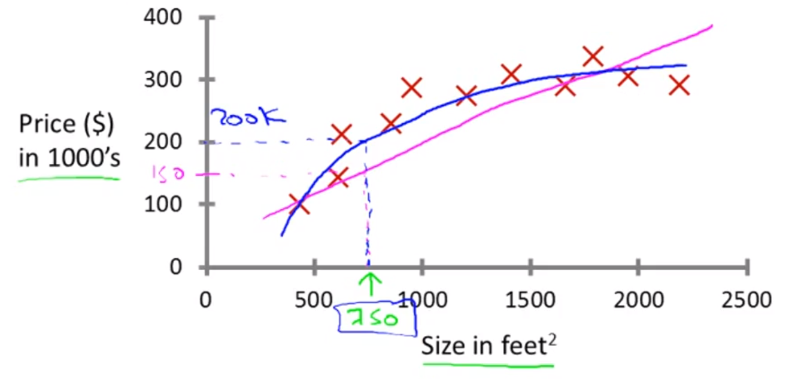
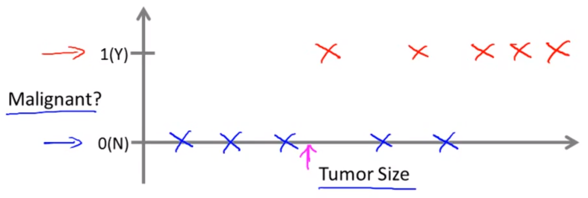
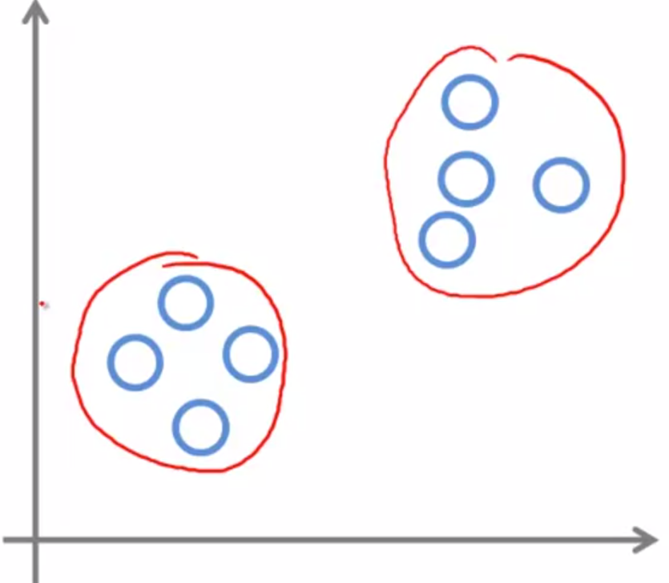

# Introduction

Basic definition and understanding of what is Machine Learning and what are the different types of Machine Learning Algorithms

### Machine Learning

##### Use Cases in Real Life:

* Database Mining
  * Large Datasets
  * Click Stream Data
  * Medical Records
  * Biology & Engineering
* Applications that can't be programmed by hand
  * Handwriting Recognition
  * Autonomous Helicopters
  * Natural Language Processing
  * Computer Vision
* Self customizing programs
  * Amazon
  * Netflix
  * Product Recommendations
* Understanding Human Learning
  * The Human Brain
  * Real Artificial Intelligence

##### What is Machine Learning?

* Field of study that gives computers the ability to learn without being explicitly programmed.
* A learning problem is said to learn from experience 'E' with respect to some task 'T' and some performance measure 'P', if its performance on 'T' as measured by 'P' improves with experience 'E'.

> Suppose your email program watches emails you do or do not mark as 'spam', and based on that learns how to better filter spam. What's the task 'T' in this setting?
>
> - [x] **Classifying emails as 'spam' or 'not-spam'**
> - [ ] Watching you label emails as 'spam' or 'not-spam'
> - [ ] Fraction of emails correctly classified as 'spam' or 'not-spam'

## Supervised Learning

* Assumes that right answers are given to the algorithm in the training set for all cases

* Also called "Regression Problems", predicts continuous valued output

  

* Can also be a Classification Problem, which can predict discrete values

  

* Small and limited number of features

> Are the following problems classification or regression problems?
>
> 1. You have a large inventory of identical items. You want to predict how many of these will sell over the next three months
>    - [ ] Classification
>    - [x] Regression
> 2. You'd like a software to examine individual customer accounts and for each account, decide if it has been hacked or compromised
>    - [x] Classification
>    - [ ] Regression
> 3. Given a picture of a person, you'd have to predict their age
>    - [ ] Classification
>    - [x] Regression
> 4. Given a patient with tumour, you'd have to predict whether the tumour is malignant or benign
>    - [x] Classification
>    - [ ] Regression

## Unsupervised Learning

* The algorithm has to find some structure in a given dataset

* Clustering Algorithm

  

* The algorithm doesn't know in advance any answer for any part of the dataset

* Some use cases

  * Organize Computer Clusters
  * Market Segmentation
  * Social Network Analysis
  * Astronomical Data Analysis

### Cocktail Party Problem

* Unsupervised learning problem
* Objective is to separate voice from background music of a person speaking over phone in a cocktail party
* Solution: ` [W, s, v] = svd((repmat(sum(x. *x, 1), size(x, 1), 1). *x) *x') `

> Which of the following can be addressed using an unsupervised learning algorithm?
>
> * [ ] Given emails labelled as 'spam' or 'not-spam', learn a spam filter
> * [x] Given a set of news articles found of the web, group them into set of items about the same story
> * [x] Given a database of customer data, automatically discover market segments and group customers into different market segments
> * [ ] Given a dataset of patients diagnosed as either having diabetes or not, learn to classify new patients as having diabetes or not

