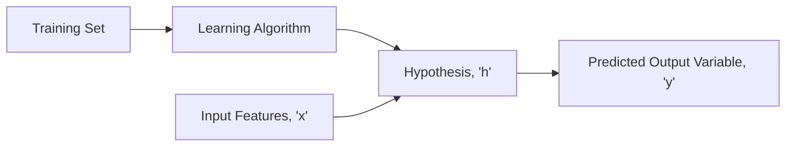

# Model and Cost Function

Let's take an example of a sample dataset which contains the housing prices in a particular city.

This is an example of:

* **Supervised Learning**: Given the "correct answer" for each example in the dataset
* **Regression Problem**: Objective is to predict real-valued output

| Size in ft^2^ (x) | Price in $100 (y) |
| ----------------- | ----------------- |
| 2104 (x^(1)^)     | 460 (y^(1)^)      |
| 1416 (x^(2)^)     | 232 (y^(2)^)      |
| 1534 (x^(3)^)     | 315 (y^(3)^)      |
| 852 (x^(4)^)      | 178 (y^(4)^)      |
| ...               | ...               |

**Notation**:

* _m_: Number of training examples
* _x's_: "Input" Variable
* _y's_: "Output" Variable
* _(x, y)_: Single Training Example
* _(x^(i)^, y^(i)^)_: i^(th)^ Training Example

