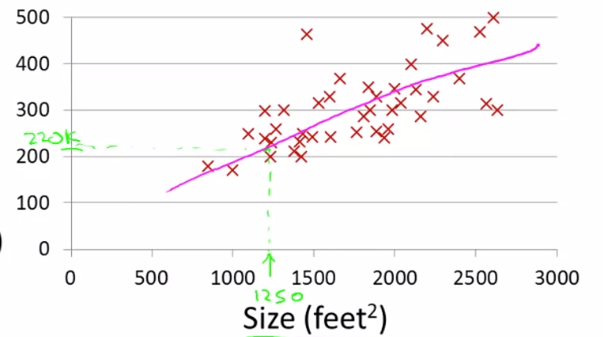
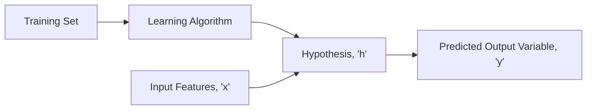
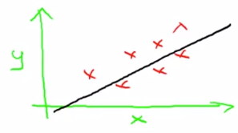
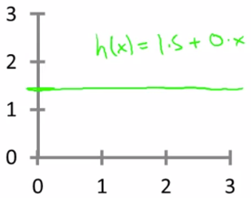
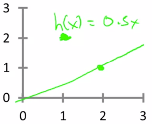
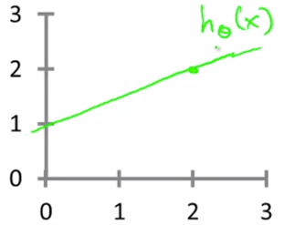

# Model and Cost Function

Let's take an example of a sample dataset which contains the housing prices in a particular city.

This is an example of:

* **Supervised Learning**: Given the "correct answer" for each example in the dataset
* **Regression Problem**: Objective is to predict real-valued output

| Size in ft^2^ (x) | Price in $100 (y) |
| ----------------- | ----------------- |
| 2104 (x^(1)^)     | 460 (y^(1)^)      |
| 1416 (x^(2)^)     | 232 (y^(2)^)      |
| 1534 (x^(3)^)     | 315 (y^(3)^)      |
| 852 (x^(4)^)      | 178 (y^(4)^)      |
| ...               | ...               |

**Notation**:

* **_m_**: Number of training examples
* **_x's_**: "Input" Variable
* **_y's_**: "Output" Variable
* **_(x, y)_**: Single Training Example
* **_(x^(i)^, y^(i)^)_**: i^(th)^ Training Example

### What is Hypothesis?

It maps from input features to output variables. It can be represented as
$$
h_\theta(x) = \theta _0 + \theta _1 x
$$
The shorthand notation for the above equation is
$$
h(x) = \theta _0 + \theta _1 x
$$
Here, $\theta _0$ and $\theta _1$ are the parameters

The black line represents the Hypothesis. This model is called **Univariate Linear Regression** or _Linear Regression with One Variable_. Below are some of the examples for certain values of the parameters $\theta _0$ and $\theta _1$.

| Parameters                                                   | Graph                            |
| ------------------------------------------------------------ | -------------------------------- |
| $\theta _0 = 1.5$ $\theta _1 = 0$ $h(x) = 1.5 + (0 * x)$ |  |
| $\theta _0 = 0$ $\theta _1 = 0.5$ $h(x) = 0 + (0.5 * x)$ |  |
| $\theta _0 = 1$ $\theta _1 = 0.5$ $h(x) = 1 + (0.5 * x)$ |  |

#### Choosing the Values of $\theta _0$ and $\theta _1$

* Choose $\theta _0$ and $\theta _1$ so that $h _\theta (x)$ is close to $y$ for our training examples

* Formulation:

    $$
    minimize_{\theta_0 \theta_1} \frac{1}{2m} \sum ^m _{i=1} (h_\theta (x^{(i)}) - y^{(i)})^2
    $$
    Where,

    - $h_\theta(x^{(i)}) = \theta_0 + \theta_1 x^{(i)}$
    - $m = $ Number of training examples

* Cost Function (Squared Error Function):

    $$
    J(\theta_0, \theta_1) = \frac{1}{2m} \sum^m_{i=1} (h_\theta(x^{(i)})-y^{(i)})^2
    $$

* Therefore, in Linear Regression, the goal is:

    $$
    minimize_{\theta_0 \theta_1} J(\theta_0,\theta_1)
    $$

**Note:** There are other cost functions that work pretty well, but the Squared Error Cost function is the one most commonly used for *Regression* problems

## Cost Function Intuition 1
Let's have a simplified version of the cost function, where the hypothesis is (assuming $\theta_0 = 0$):
$$
h_\theta(x) = \theta_1 x
$$
We have the Cost Function,
$$
J(\theta_1) = \frac{1}{2m} \sum^m_{i=1} (h_\theta(x^{(i)}) - y^{(i)})^2
$$
And our goal is:
$$
minimize_{\theta_1} J(\theta_1)
$$

When $\theta_1=1$:
$$
\begin{align*}
J(\theta_1) &= \frac{1}{2m} \sum^m_{i=1} (h_\theta(x^{(i)})-y^{(i)})^2 \\
&= \frac{1}{2m} \sum^m_{i=1} ({\theta_1 x^{(i)} - y^{(i)}})^2 \\
&= \frac{1}{2*3} [(1*1 - 1)^2 + (1*2 - 2)^2 + (1*3 - 3)^2] \\
&= \frac{1}{6} (0^2 + 0^2 + 0^2) \\
&= 0
\end{align*}
$$

##### When $\theta_1=0.5$:
$$
\begin{align*}
J(\theta_1) &= \frac{1}{2m} \sum^m_{i=1} (h_\theta(x^{(i)})-y^{(i)})^2 \\
&= \frac{1}{2m} \sum^m_{i=1} ({\theta_1 x^{(i)} - y^{(i)}})^2 \\
&= \frac{1}{2*3} [(0.5*1 - 1)^2 + (0.5*2 - 2)^2 + (0.5*3 - 3)^2] \\
&= \frac{1}{2*3} [(0.5 - 1)^2 + (1 - 2)^2 + (1.5 - 3)^2] \\
&= \frac{1}{2*3} [0.5^2 + 1^2 + 1.5^2] \\
&= \frac{1}{6} * 3.5 \\
&= 0.58
\end{align*}
$$

##### When $\theta_1=0$:

$$
\begin{align*}
J(\theta_1) &= \frac{1}{2m} \sum^m_{i=1} (h_\theta(x^{(i)})-y^{(i)})^2 \\
&= \frac{1}{2m} \sum^m_{i=1} ({\theta_1 x^{(i)} - y^{(i)}})^2 \\
&= \frac{1}{2*3} [(0*1 - 1)^2 + (0*2 - 2)^2 + (0*3 - 3)^2] \\
&= \frac{1}{2*3} [(1^2 + 2^2 + 3^2] \\
&= \frac{1}{6} * 14 \\
&= 2.3
\end{align*}
$$

##### Plot for $J(\theta_1)$ as a function of parameter $\theta_1$:

The value that minimizes $J(\theta_1)$ here is $J(\theta_1) = 1$ for this particular dataset

## Cost Function Intuition 2

#### Problem Formulation:

Hypothesis:
$$
h_\theta(x) = \theta_0 + \theta_1 x
$$
Parameters: $\theta_0, \theta_1$

Cost Function:
$$
J(\theta_0,\theta_1) = \frac{1}{2m} \sum^m_{i=1} (h_\theta(x^{(i)}) - y^{(i)})^2
$$
And our goal is:
$$
minimize_{\theta_0, \theta_1} J(\theta_0,\theta_1)
$$

Let's make a random hypothesis on a training set of housing prices:

Here,
$
\theta_0 = 50 \\
\theta_1 = 0.06 \\
h_\theta(x) = 50+0.06x
$

Plot for $J(\theta_1)$ as a function of parameter $\theta_1$ and $\theta_1$:

##### Example 1:

Selected point (cost) will have $\theta_0 = 800$ and $\theta_1=-0.15$, which isn't a good fit for the data

##### Example 2:

Selected point (cost) will have $\theta_0 = 360$ and $\theta_1 = 0$, which isn't a good fit for the data

##### Example 3:

Selected point (cost) will have $\theta_0 = 500$ and $\theta_1 = 0$, which isn't a good fit for the data

#### Example 4:

Selected point (cost) will have $\theta_0 = 250$ and $\theta_1 = 0.15$, which looks like a good fit for the data, even though it's not quite at the minimum

