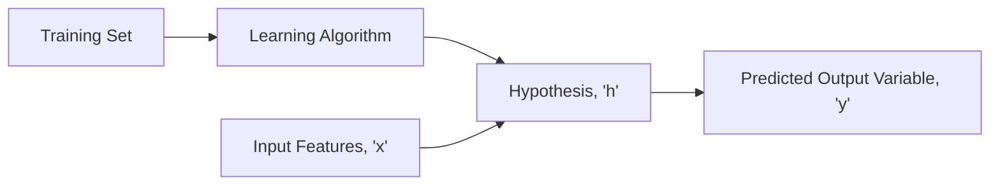

# Model and Cost Function

Let's take an example of a sample dataset which contains the housing prices in a particular city.

This is an example of:

* **Supervised Learning**: Given the "correct answer" for each example in the dataset
* **Regression Problem**: Objective is to predict real-valued output

| Size in ft^2^ (x) | Price in $100 (y) |
| ----------------- | ----------------- |
| 2104 (x^(1)^)     | 460 (y^(1)^)      |
| 1416 (x^(2)^)     | 232 (y^(2)^)      |
| 1534 (x^(3)^)     | 315 (y^(3)^)      |
| 852 (x^(4)^)      | 178 (y^(4)^)      |
| ...               | ...               |

**Notation**:

* **_m_**: Number of training examples
* **_x's_**: "Input" Variable
* **_y's_**: "Output" Variable
* **_(x, y)_**: Single Training Example
* **_(x^(i)^, y^(i)^)_**: i^(th)^ Training Example

### What is Hypothesis?

It maps from input features to output variables. It can be represented as
$$
h_\theta(x) = \theta _0 + \theta _1 x
$$
The shorthand notation for the above equation is
$$
h(x) = \theta _0 + \theta _1 x
$$
Here, $\theta _0$ and $\theta _1$ are the parameters

The black line represents the Hypothesis. This model is called **Univariate Linear Regression** or _Linear Regression with One Variable_. Below are some of the examples for certain values of the parameters $\theta _0$ and $\theta _1$.

| Parameters                                                   | Graph                            |
| ------------------------------------------------------------ | -------------------------------- |
| $\theta _0 = 1.5$ $\theta _1 = 0$ $h(x) = 1.5 + (0 * x)$ |  |
| $\theta _0 = 0$ $\theta _1 = 0.5$ $h(x) = 0 + (0.5 * x)$ |  |
| $\theta _0 = 1$ $\theta _1 = 0.5$ $h(x) = 1 + (0.5 * x)$ |  |

#### Choosing the Values of $\theta _0$ and $\theta _1$

* Choose $\theta _0$ and $\theta _1$ so that $h _\theta (x)$ is close to $y$ for our training examples

* Formulation:

    $minimize_{\theta_0 \theta_1} \frac{1}{2m} \sum ^m _{i=1} (h_\theta (x^{(i)}) - y^{(i)})$

    Where,

    - $h_\theta(x^{(i)}) = \theta_0 + \theta_1 x^{(i)}$
    - $m = $ Number of training examples

* Cost Function (Squared Error Function):

    $J(\theta_0, \theta_1) = \frac{1}{2m} \sum^m_{i=1} (h_\theta(x^{(i)})-y^{(i)})^2$

* Therefore, in Linear Regression, the goal is:

    $minimize_{\theta_0 \theta_1} J(\theta_0,\theta_1)$

