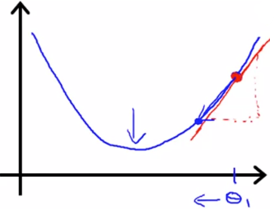
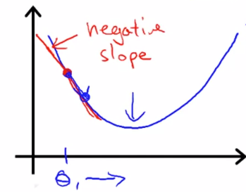
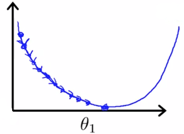
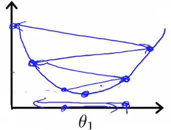
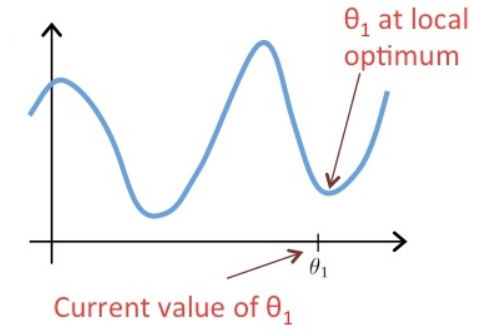
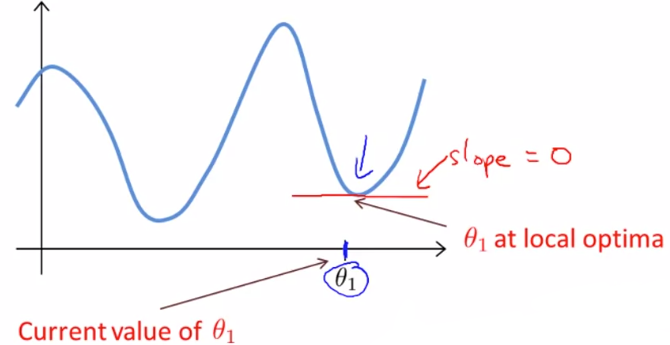
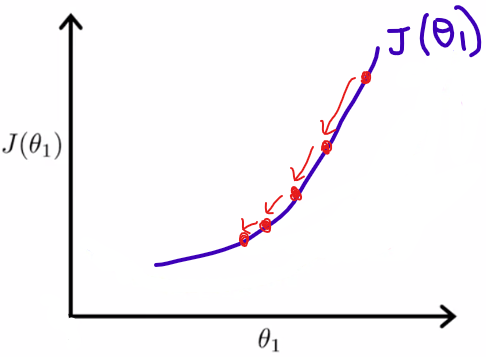
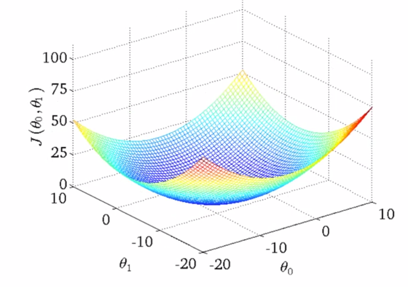

# Parameter Learning

## Gradient Descent

In the above representation,

- x-axis represents $\theta_0$
- y-axis represents $\theta_1$
- z-axis represents the cost function $J(\theta_0, \theta_1)$

We will know that we have succeeded when our cost function is at the very bottom of the pits in our graph (when its value is the minimum). The way we do this is by taking the derivative (the tangential line to a function) of our cost function. The slope of the tangent is the derivative at that point and it will give us a direction to move towards. We make steps down the cost function in the direction with the steepest descent. The size of each step is determined by the parameter $\alpha $, which is called the learning rate.

For example, the distance between each 'star' in the graph above represents a step determined by our parameter $\alpha $. A smaller $\alpha $ would result in a smaller step and a larger α results in a larger step. The direction in which the step is taken is determined by the partial derivative of $J(\theta_0,\theta_1)$. Depending on where one starts on the graph, one could end up at different points. The image above shows us two different starting points that end up in two different places.

#### Problem Setup:

- Have some function $J(\theta_0, \theta_1)$
- Objective is to $min_{\theta_0, \theta_1} J(\theta_0, \theta_1)$

#### Outline:

- Start with some $\theta_0, \theta_1$
- Keep changing $\theta_0, \theta_1$ to reduce $J(\theta_0, \theta_1)$ until we hopefully end up at a minimum

#### Algorithm:

Repeat until convergence for $j=0$ and $j=1$

{
$$
\theta_j := \theta_j - \alpha \frac{\partial}{\partial\theta_j} J(\theta_0, \theta_1)
$$
}

And simultaneously update $\theta_0$ and $\theta_1$
$$
temp0 := \theta_0 - \alpha \frac{\partial}{\partial \theta_0} J(\theta_0, \theta_1) \\
temp1 := \theta_1 - \alpha \frac{\partial}{\partial \theta_1} J(\theta_0, \theta_1) \\
\theta_0 := temp0 \\
\theta_1 := temp1
$$
Here,

- $\alpha$ is the learning rate

**Note:**

- Assignment Operator will be denoted by $a:=b$ (takes the value of $b$ and overwrite the value of $a$ with that value)
- Truth Assertion Operator will be denoted by $a=b$ (assert/claim that the value of $a$ is equal to the value of $b$)

Example of **incorrect** implementation of simultaneous update (can behave in strange ways):
$$
temp0 := \theta_0 - \alpha \frac{\partial}{\partial \theta_0} J(\theta_0, \theta_1) \\
\theta_0 := temp0 \\
temp1 := \theta_1 - \alpha \frac{\partial}{\partial \theta_1} J(\theta_0, \theta_1) \\
\theta_1 := temp1
$$

> Suppose $\theta_0 = 1$ and $\theta_1=2$, and we simultaneously update $\theta_0$ and $\theta_1$ using the rule $\theta_j := \theta_j + \sqrt{\theta_0 \theta_1}$ (for $j=0$ and $j=1$). What are the resulting values of $\theta_0$ and $\theta_1$?
>
> - [ ] $\theta_0 = 1, \theta_1 = 2$
> - [x] $\theta_0 = 1 + \sqrt{2}, \theta_1 = 2 + \sqrt{2}$
> - [ ] $\theta_0 = 2 + \sqrt{2}, \theta_1 = 1 + \sqrt{2}$
> - [ ] $\theta_0 = 1 + \sqrt{2}, \theta_1 = 2 + \sqrt{(1+\sqrt{2}) * 2}$

## Gradient Descent Intuition

Let’s consider the Gradient Descent Algorithm,
$$
\theta_1 := \theta_1 - \alpha \frac{d}{d\theta_1} J(\theta_1)
$$

##### Example 1:

Here, $\frac{d}{d\theta_1} J(\theta_1) \geq 0$

Therefore, $\theta_1 := \theta_1 - \alpha$ (Positive Slope)

##### Example 2:

Here, $\frac{d}{d \theta_1} J(\theta_1) \leq 0$

Therefore, $\theta_1 := \theta_1 - \alpha $ (Negative Slope)

##### When $\alpha $ is too small:

- Gradient Descent can be slow

##### When $\alpha $ is too large:

- Gradient Descent can overshoot the minimum
- May fail to converge, or even diverge

> Suppose $\theta_1$ is at the local optimum of $J(\theta_1)$, as shown in the figure below. What do you think one step of Gradient Descent will do?
>
> 
>
> - [x] Leave $\theta_1$ unchanged
> - [ ] Change $\theta_1$ in a random direction
> - [ ] Move $\theta_1$ in the direction of the global minimum of $J(\theta_1)$
> - [ ] Decrease $\theta_1$
>
> **Reason:**
>
> At the local optimum, the value of the slope will be $0$.
>
> 
>
> Therefore,
> $$
> \frac{d}{d\theta_1} J(\theta_1) = 0
> $$
> Hence,
> $$
> \begin{align*}
> \theta_1 &:= \theta_1 - \alpha \frac{d}{d\theta_1} J(\theta_1) \\
> \theta_1 &:= \theta_1 - \alpha \sdot 0 \\
> \theta_1 &:= \theta_1
> \end{align*}
> $$

Gradient Descent can converge to a local minimum, even with the learning rate $\alpha $ fixed.

- After each iteration, the derivative $\frac{d}{d\theta_1} J(\theta_1)$ keeps getting smaller because the slope decreases
- So, as we approach a local minimum, gradient descent will automatically take small steps
- Therefore, there’s no need to decrease $\alpha $ over time

## Gradient Descent for Linear Regression

| Gradient DescentAlgorithm                                    | Linear Regression Model                                      |
| :----------------------------------------------------------- | ------------------------------------------------------------ |
| *repeat until convergence* { $$\theta_j := \theta_j - \alpha \frac{\partial}{\partial\theta_j} J(\theta_0, \theta_1)$$ } (for $j=1$ and $j=0 $) | $$h_\theta(x) = \theta_0 + \theta_1 x \\ \space \\ J(\theta_0, \theta_1) = \frac{1}{2m} \sum^m_{i=1} (h_\theta(x^{(i)}) - y^{(i)})^2$$ |

Applying Gradient Descent to minimize squared error cost function,
$$
\begin{align*}
\frac{\partial}{\partial \theta_j} J(\theta_0, \theta_1) &= \frac{\partial}{\partial \theta_j} \sdot \frac{1}{2m} \sdot \sum^m_{i=1} \sdot (h_\theta(x^{(i)})- y^{(i)})^2 \\
&= \frac{\partial}{\partial \theta_j} \sdot \frac{1}{2m} \sdot \sum^m_{i=1} \sdot (\theta_0 + \theta_1 \sdot x^{(i)} - y^{(i)})^2
\end{align*}
$$
We get two cases,
$$
[For \space \theta_0] \space j = 0 : \frac{\partial}{\partial \theta_0} J(\theta_0, \theta_1) = \frac{1}{m} \sdot \sum^m_{i=1} \sdot (h_\theta (x^{(i)}) - y^{(i)}) \\
[For \space \theta_1] \space j = 1 : \frac{\partial}{\partial \theta_1} J(\theta_0, \theta_1) = \frac{1}{m} \sdot \sum^m_{i=1} \sdot (h_\theta (x^{(i)}) - y^{(i)}) \sdot x^{(i)}
$$
Plugging these into Gradient Descent Algorithm, we get,

*repeat until convergence* {
$$
\theta_0 := \theta_0 - \alpha \sdot \frac{1}{m} \sdot \sum^m_{i=1} (h_\theta (x^{(i)}) - y^{(i)}) \\
\theta_1 := \theta_1 - \alpha \sdot \frac{1}{m} \sdot \sum^m_{i=1} (h_\theta (x^{(i)}) - y^{(i)}) \sdot x^{(i)}
$$

} [Update $\theta_0$ and $\theta_1$ simultaneously]

> **Note:**
>
> - This method is also called **Batch Gradient Descent**, because each step of Gradient Descent uses all of the training examples
> - Gradient Descent is **NOT** guaranteed to find the global minimum for any function $J(\theta_0, \theta_1)$

Cost Function for Linear Regression will always be a **Convex Function**:

> Which of the following are true statements?
>
> - [ ] To make gradient descent coverage, we must slowly decrease $\alpha$ over time
> - [ ] Gradient descent is guaranteed to find the global minimum for any function $J(\theta_0, \theta_1)$
> - [x] Gradient descent can converge even if $\alpha$ is kept fixed (But $\alpha$ cannot be too large, or else it may fail to converge)
> - [x] For the specific choice of cost function $J(\theta_0, \theta_1)$ used in linear regression, there are no local optima (other than the global optimum)

