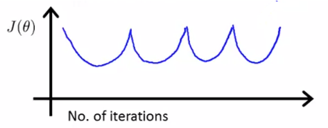
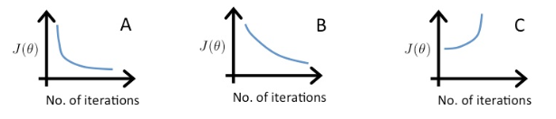

# Multivariate Linear Regression

#### Univariate Linear Regression

In univariate linear regression, we had something like this:

| Size in ft^2^ (x) | Price in $100 (y) |
| ----------------- | ----------------- |
| 2104 (x^(1)^)     | 460 (y^(1)^)      |
| 1416 (x^(2)^)     | 232 (y^(2)^)      |
| 1534 (x^(3)^)     | 315 (y^(3)^)      |
| 852 (x^(4)^)      | 178 (y^(4)^)      |
| ...               | ...               |

And we calculate our hypothesis as:
$$
h_\theta (x) = \theta_0 + \theta_1 x
$$

#### Multivariate Linear Regression

We will have more features here, such as the dataset below:

| Size $(x_1)$ | Bedrooms $(x_2)$ | Floors $(x_3)$ | House Age $(x_4)$ | Price $(y)$ |
| :----------: | :--------------: | :------------: | :---------------: | :---------: |
|     2104     |        5         |       1        |        45         |     460     |
|     1416     |        3         |       2        |        40         |     232     |
|     1534     |        3         |       2        |        30         |     315     |
|     852      |        2         |       1        |        36         |     178     |
|     ...      |       ...        |      ...       |        ...        |     ...     |

Here,

- $n$ = Number of features
- $x^{(i)}$ = Input features of i^th^ training example
- $x^{(i)}_j$ = Value of feature $j$ in i^th^ training example

For instance,
$$
x^{(2)} =
\begin{bmatrix}
1416 \\
3 \\
2 \\
40
\end{bmatrix}
$$
To get the values from the vectors,

$x^{(2)}_3 = 2$

$x^{(3)}_2 = 3$

$x^{(1)}_4 = 45$

Our hypothesis will now be:
$$
h_\theta (x) = \theta_0 + \theta_1 x_1 + \theta_2 x_2 + \theta_3 x_3
$$

### Simplifying the Hypothesis

In multivariate linear regression, our hypothesis looks like
$$
\begin{align*}
h_\theta (x) &= \theta_0 + \theta_1 x_1 + \theta_2 x_2 + \cdots + \theta_n x_n \\
&= \theta_0 x_0 + \theta_1 x_1 + \theta_2 x_2 + \cdots + \theta_n x_n \quad [Let \space x_0 = 1] \\
&= \theta^T x
\end{align*}
$$
Here,
$$
x =
\begin{bmatrix}
x_0 \\
x_1 \\
\vdots \\
x_n
\end{bmatrix} _{[(n+1)*1]}
\quad \quad \quad \quad
\theta =
\begin{bmatrix}
\theta_0 \\
\theta_1 \\
\vdots \\
\theta_n
\end{bmatrix} _{[(n+1)*1]}
$$
Parameters = $\theta_0, \theta_1, \theta_2, \cdots, \theta_n = \theta$

Cost Function will be
$$
J(\theta_0, \theta_1, \theta_2, \cdots, \theta_n) = \frac{1}{2m} \sdot \sum^m_{i=1} (h_\theta (x^{(i)}) - y^{(i)})^2
\\
=> J(\theta) = \frac{1}{2m} \sdot \sum^m_{i=1} (h_\theta (x^{(i)}) - y^{(i)})^2
$$

#### Gradient Descent

*repeat* {
$$
\theta_j := \theta_j - \alpha \frac{\partial}{\partial \theta_j} J(\theta_0, \theta_1, \theta_2, \cdots, \theta_n)
$$
} [Simultaneously update $\theta_j$ for every $j=0, 1, 2, \cdots, n$]

Or, we can say

*repeat* {
$$
\theta_j := \theta_j - \alpha \sdot \frac{1}{m} \sdot \sum^m_{i=1} (h_\theta(x^{(i)}) - y^{(i)}) \sdot x^{(i)}_j
$$
} [Simultaneously update $\theta_j$ for every $j=0, 1, 2, \cdots, n$]

> When there are ‘n’ features, we define the cost function as
> $$
> J(\theta) = \frac{1}{2m} \sdot \sum^m_{i=1} (h_\theta(x^{(i)}) - y^{(i)})^2
> $$
> For linear regression, which of the following are also equivalent and correct definitions of $J(\theta)$?
>
> - [x] $J(\theta) = \frac{1}{2m} \sum^m_{i=1} (\theta^T x^{(i)} - y^{(i)})^2$
> - [x] $J(\theta) = \frac{1}{2m} \sum^m_{i=1}((\sum^n_{j=0} \theta_j x^{(i)}_j) - y^{(i)})^2$
> - [ ] $J(\theta) = \frac{1}{2m} \sum^m_{i=1}((\sum^n_{j=1} \theta_j x^{(i)}_j) - y^{(i)})^2$
> - [ ] $J(\theta) = \frac{1}{2m} \sum^m_{i=1} ((\sum^n_{j=0} \theta_j x^{(i)}_j) - (\sum^n_{j=0} y^{(i)}_j))^2$

###### Update Rules:

$$
\theta_0 := \theta_0 - \alpha \sdot \frac{1}{m} \sdot \sum^m_{i=1} (h_\theta (x^{(i)}) - y^{(i)}) \sdot x^{(i)}_0 \\
\theta_1 := \theta_1 - \alpha \sdot \frac{1}{m} \sdot \sum^m_{i=1} (h_\theta (x^{(i)}) - y^{(i)}) \sdot x^{(i)}_1 \\
\theta_2 := \theta_2 - \alpha \sdot \frac{1}{m} \sdot \sum^m_{i=1} (h_\theta (x^{(i)}) - y^{(i)}) \sdot x^{(i)}_2 \\
\vdots \\
\theta_n := \theta_n - \alpha \sdot \frac{1}{m} \sdot \sum^m_{i=1} (h_\theta (x^{(i)}) - y^{(i)}) \sdot x^{(i)}_n
$$

## Feature Scaling

The objective of Feature Scaling is to make sure that the features are on a similar scale, so that gradient descent can converge more quickly.

For example,

- $x_1$ = Size range (0 to 2000 feet)
- $x_2$ = Number of bedroome (1-5)

For such a dataset, the plot of the cost function can be shaped eliptical. Gradient descent may oscillate back and forth and take a long time to reach the global minimum.

When we scale, gradient descent can find a much more direct path to the global minimum.

To scale $x_1$ and $x_2$ here,
$$
x_1 = \frac{size}{2000}
\quad \quad
x_2 = \frac{bedrooms}{5}
$$
**Note:** We want to get every feature into approzimately a $-1 \leq x_i \leq 1$ range

Some examples of feature scaling:

| Properly Scaled      | Poorly Scaled                |
| -------------------- | ---------------------------- |
| $0 \leq x \leq 3$    | $-100 \leq x \leq 100$       |
| $-2 \leq x \leq 0.5$ | $-0.0001 \leq x \leq 0.0001$ |

##### Mean Normalization

$$
x_1 = \frac{size-100}{2000}
\quad \quad \quad
x_2 = \frac{bedroom-2}{5}
\\
x_i = \frac{old \space x_1 - \mu_i}{range \space of \space x_i}
$$

### Debugging: Making sure Gradient Descent works correctly

- The value of $J(\theta)$ should decrease after each iteration
- When the line flattens, it suggests that gradient descent has converged
- **Automatic Convergence Test:** Declare convergence if $J(\theta)$ decreases by less than $10^{-3}$ (or any other threshold) in one iteration

##### Examples of Gradient Descent not working:

  

Use smaller values of the learning rate $\alpha$ to fix these, but if $\alpha$ is too small, gradient descent can be slow to converge

##### Examples of Learning Rates

A: $\alpha = 0.1$

B: $\alpha=0.01$

C: $\alpha = 1$

**Note:** To choose $\alpha$, start from small and try range of values multiplied by 3 each time. For instance,
$$
\cdots \rarr 0.001 \rarr 0.003 \rarr 0.01 \rarr 0.03 \rarr 0.1 \rarr 0.3 \rarr 1 \rarr \cdots
$$

## Polynimial Regression

Suppose we have the housing prices problems. Given data of prices with the features “frontage” and “depth” of houses, we’ll have a hypothesis as:
$$
h_\theta(x) = \theta_0 + \theta_1 \sdot frontage + \theta_2 \sdot depth
$$
But we don’t necessarily need to define such hypothesis, instead we can determine which features really determines the prices, such as the “area” of the house. We can create a new feature:

$x = frontage * depth$

$h_\theta(x) = \theta_0 + \theta_1 x$

We can fit a **Quadratic Model** to the data and obtain a function like this:
$$
h_\theta(x) = \theta_0 + \theta_1 x + \theta_2 x^2
$$

However, it fits the data pretty well, but doesn’t make sense because quadratic functions go down, but housing functions never go down with increase in size. We can try to fit a **Cubic Function** instead and get a better fit:
$$
h_\theta(x) = \theta_0 + \theta_1 x + \theta_2 x^2 + \theta_3 x^3
$$

$$
\begin{align*}
h_\theta(x) &= \theta_0 + \theta_1 x_1 + \theta_2 x_2 + \theta_3 x_3 \\
&= \theta_0 + \theta_1 x + \theta_2 (size)^2 + \theta_3 (size)^3
\end{align*}
$$
We can also try the **Square Root Function** which flattens out a bit and doesn’t come down
$$
h_\theta (x) = \theta_0 + \theta_1 (size) + \theta_2 \sqrt{(size)}
$$

