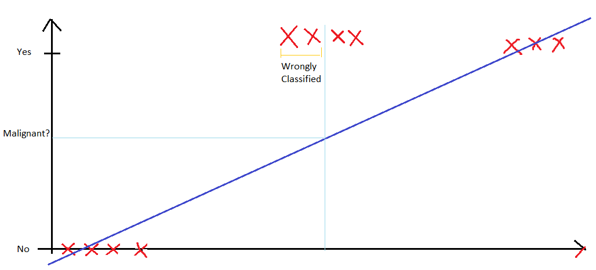

# Classification and Representation

### Using Linear Regression as a Classifier

Suppose we have a dataset of tumors being malignant or not $y \space \epsilon \space \{0, 1\} $

If we apply linear regression,
$$
h_\theta (x) = \theta^T \sdot x
$$
The hypothesis should look like the one represented above. Then we can use threshold classifier output as following:

- If $h_\theta (x) \geq 0.5$, then predict $y=1$
- If $h_\theta (x) < 0.5$, then predict $y=0$

But imagine, we add a new data which looks like the one represented below, the hypothesis will change.

The linear regression classifier will wrongly classify some data points because of the added data. The straight line fit changes in such a scenario.

> Which of the following is true?
>
> - [ ] If linear regression doesn't work on a classification task as in the previous example shown in the video, applying feature scaling may help
> - [ ] If the training set satisfies $0 \leq y^{(i)} \leq 1$ for every training example $(x^{(i)}, y^{(i)})$, then linear regression's prediction will also satisfy $0 \leq h_\theta (x) \leq 1$ for all values of $x$
> - [ ] If there is a feature x*x* that perfectly predicts $y$, that is if $y=1$ when $x \geq c$ and $y=0$ whenever $x < c$  (for some constant $c$), then linear regression will obtain zero classification error
> - [x] None of the above statements are true

#### Hypothesis Representation

Aim: $0 \leq h_\theta (x) \leq 1$

Now, $h_\theta (x) = g (\theta^T x)$

Where,
$$
g(z) = \frac{1}{1 + e^{- \theta^T x}}
$$

Therefore, we can write the hypothesis as:
$$
h(x) = \frac{1}{1 + e^{-\theta^T x}}
$$
We interpret the value of $h(x)$ as the estimated probability that $y=1$ on input $x$. For example,
$$
x =
\begin{bmatrix}
x_0 \\
x_1
\end{bmatrix}
=
\begin{bmatrix}
1 \\
tumorSize
\end{bmatrix}
$$
Suppose $h(x) = 0.7$

Then the patient has a 70% chance of the tumor being malignant.

##### Formal Representation

$$
h_\theta (x) = P(y=1 | x;\theta)
$$

(Probability that $y=1$, given $x$, parameterized by $\theta$)

**Note:** $P(y=0 | x;\theta) + P(y=1 | x;\theta) = 1$

## Decision Boundary

- Predict $y=1$ if $h_\theta (x) \geq 0.5$, that is $\theta^T \sdot x \geq 0$
- Predict $y=0$ if $h_\theta (x) < 0.5$, that is $\theta^T \sdot x < 0$

Suppose, we have

$h_\theta(x) = g(\theta_0 + \theta_1 x_1 + \theta_2 x_2)$

And let,

$\theta_0 = -3$

$\theta_1 = 1$

$\theta_2 = 1$

Predict $y=1$ if:
$$
-3 + x_1 + x_2 \geq 0
$$
Therefore, $x_1 + x_2 < 3$ will be a straight line. This straight line is the region where $h_\theta (x) = 0.5$ (Decision Boundary). The decision boundary will now look like this:

### Non-Linear Decision Boundaries

Imagine we have the following hypothesis,
$$
h_\theta (x) = g(\theta_0 + \theta_1 x_1 + \theta_2 x_2 + \theta_3 x^2_1 + \theta_4 x^2_2)
$$
And let’s choose,

$\theta_0 = -1$

$\theta_1 = 0$

$\theta_2 = 0$

$\theta_3 = 1$

$\theta_4 = 1$

We get,
$$
-1 + x^2_1 + x^2_2 \geq 0
$$
Therefore our decision boundary will be a circle,
$$
x_1^2 + x_2^2 \geq 1
$$
Decision boundary will look like this:

