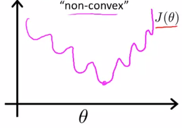
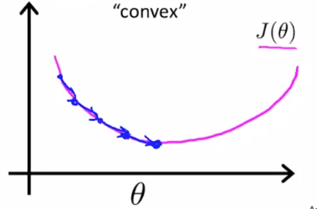
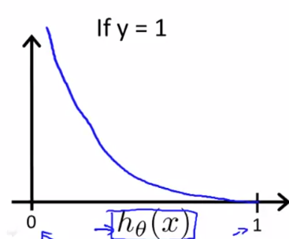
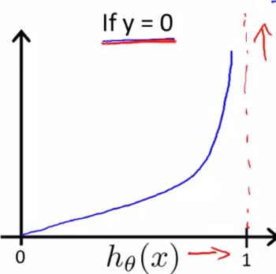

# Logistic Regression Model

### Cost Function

For linear regression, we had our cost function as:
$$
J(\theta) = \frac{1}{m} \sdot \sum_{i=1}^m \frac{1}{2} \sdot (h_\theta(x^{(i)}) - y^{(i)})^2
$$
We’ll use an alternateway of writing the cost function. Instead of using the squared error term as above, we’ll use:
$$
J(\theta) = \frac{1}{m} \sdot \sum_{i=1}^m cost(h_\theta(x^{(i)}), y^{(i)})
\\
=> cost(h_\theta(x), y) = \frac{1}{2} (h_\theta(x) - y)^2
$$
If we plot this function for logistic regression, when
$$
h_\theta(x) = \frac{1}{1 + e^{-\theta^Tx}}
$$
We’ll get a plot of non-convex function like this:

This function will have many local optima, and we cannot run gradient descent on this sort of function. Instead, we want a convex function which will guarantee that gradient descent will converge on the global minimum.

We’ll therefore use,
$$
cost(h_\theta(x), y) =
\begin{cases}
-log(h_\theta(x)) & \text{if $y=1$} \\[2ex]
-log(1- h_\theta(x)) & \text{if $y=0$}
\end{cases}
$$

If $y=1$ and $h_\theta(x) = 1$, then $cost=0$

But as $h_\theta(x) \rarr 0$, $cost \rarr \infin$

It captures intuition that if $h_\theta(x)=0$, [predict $P(y=1|x;\theta) = 0$], but $y=1$, we’ll penalize the learning algorithm by a very large cost. It’s like the probability of a patient to have a malignant tumor is 0, even though the value of $y=1$.

Therefore,
$$
cost(h_\theta(x),y) =
\begin{cases}
0 & \text{if $h_\theta(x)=y$} \\[2ex]
\infin & \text{if $y=0$ and $h_\theta(x) \rarr 1$} \\[2ex]
\infin & \text{if $y=0$ and $h_\theta(x) \rarr 0$}
\end{cases}
$$

> In logistic regression, the cost function for our hypothesis outputting (predicting) $h_\theta(x)$ on a training example that has label $y \epsilon \{0, 1\}$ is:
> $$
> cost(h_\theta(x), y) =
> \begin{cases}
> -log(h_\theta(x)) & \text{if $y=1$} \\[2ex]
> -log(1- h_\theta(x)) & \text{if $y=0$}
> \end{cases}
> $$
> Which of the following are true? Check all that apply.
>
> - [x] If $h_\theta(x)=y$, then $cost(h_\theta(x), y) =0$ (for $y=0$ and $y=1$)
> - [x] If $y=0$, then $cost(h_\theta(x), y) \rarr \infin$ as $h_\theta(x) \rarr 1$
> - [ ] If $y=0$, then $cost(h_\theta(x), y) \rarr \infin$ as $h_\theta(x) \rarr 0$
> - [x] Regardless of whether $y=0$ or $y=1$, if $h_\theta(x)=0.5$, then $cost(h_\theta(x), y) > 0$

## Simplifying the Cost Function

We have our cost function:
$$
cost(h_\theta(x), y) =
\begin{cases}
-log(h_\theta(x)) & \text{if $y=1$} \\[2ex]
-log(1- h_\theta(x)) & \text{if $y=0$}
\end{cases}
$$
We can write the cost function in a simpler way as follows:
$$
cost(h_\theta(x), y) = -y \sdot log(h_\theta(x)) - (1-y) \sdot log(1- h_\theta(x))
$$
Therefore,
$$
\begin{align}
J(\theta) &= \frac{1}{m} \sdot \sum_{i=1}^m cost(h_\theta(x^{(i)}) - y^{(i)}) \\
&= - \frac{1}{m} \Biggl[\sum_{i=1}^m y^{(i)} \sdot log(h_\theta(x^{(i)})) + (1-y^{(i)}) \sdot log(1-h_\theta(x^{(i)})) \Biggr]
\end{align}
$$
To fit the parameters $\theta$, minimize $J(\theta)$ for $\theta$

To give a prediction from new $x$, output $h_\theta(x) = \frac{1}{1+e^{- \theta^T x}}$

#### Gradient Descent

$$
J(\theta) = - \frac{1}{m} \Biggl[\sum_{i=1}^m y^{(i)} \sdot log(h_\theta(x^{(i)})) + (1-y^{(i)}) \sdot log(1-h_\theta(x^{(i)})) \Biggr]
$$

We want to minimize $\theta$ in $J(\theta)$:

*repeat* {
$$
\theta_j := \theta_j - \alpha \frac{\partial}{\partial \theta_j} J(\theta)
$$
} [Simultaneously update all $\theta_j$]

This update rule is exactly the same as Linear Regression, except the fact that the hypothesis has changed

$\theta$ updates on every iteration:
$$
\theta_0 := \theta_0 - \alpha \sdot \sum_{i=1}^m (h_\theta(x^{(i)}) - y^{(i)}) \sdot x_0^{(i)} \\
\theta_1 := \theta_1 - \alpha \sdot \sum_{i=1}^m (h_\theta(x^{(i)}) - y^{(i)}) \sdot x_1^{(i)} \\
\theta_2 := \theta_2 - \alpha \sdot \sum_{i=1}^m (h_\theta(x^{(i)}) - y^{(i)}) \sdot x_2^{(i)} \\
\vdots \\
\theta_n := \theta_n - \alpha \sdot \sum_{i=1}^m (h_\theta(x^{(i)}) - y^{(i)}) \sdot x_n^{(i)}
$$

Vectorized implementation of $\theta$ updates (instead of using a ‘for’ loop):
$$
\theta := \theta - \alpha \sdot \sum_{i=1}^m (h_\theta(x^{(i)}) - y^{(i)}) \sdot x^{(i)} \\[2ex]
(or) \\[2ex]
\theta := \theta - \frac{\alpha}{m} \sdot X^T (g(X\theta) - \overrightarrow{y}
$$
