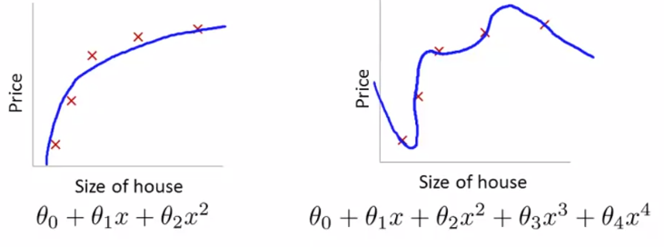
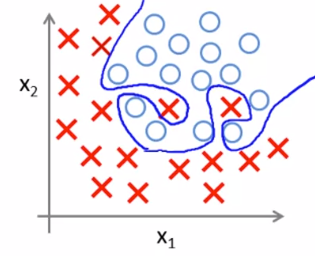
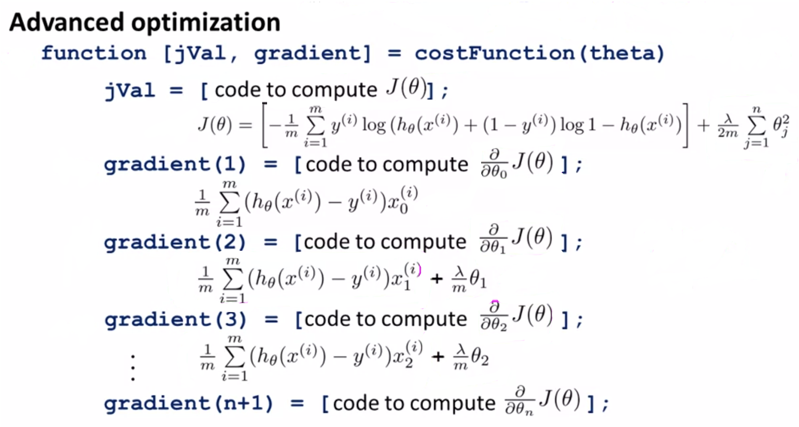

# Overfitting

There are two ways that our model can end up not performing well:

- Underfit / High Bias
- Overfit / High Variance

Overfitting occurs if we have too many features and the learnt hypothesis fits the training set too well and may even turn out to be 0 or close to 0, but fail to generalize new examples
$$
J(\theta) = \frac{1}{2m} \sum_{i=1}*m (h_\theta(x^{(i)})-y^{(i)})^2 \approx 0
$$

> Consider the medical diagnosis problem of classifying tumours as malignant or benign. If a hypothesis has overfit the training set, it means that:
>
> - [ ] It makes accurate predictions for examples in the training set and generalizes well to make accurate predictions on new, previously unseen examples
> - [ ] It does not make accurate predictions for examples in the training set, but it does generalize well to make accurate predictions on new, previously unseen examples
> - [x] It makes accurate predictions for examples in the training set, but it does not generalize well to make accurate predictions on new, previously unseen examples
> - [ ] It does not make accurate predictions for examples in the training set and does not generalize well to make accurate predictions on new, previously unseen examples.

#### Addressing Overfitting

- Reduce Number of Features
    - Manually select which features to keep
    - Model Selection Algorithm
- Regularization
    - Keep all the features, but reduce magnitude or values of parameters $\theta$
    - Works well when we have a lot of features, each of which contributes a bit to predicting $y$

## Cost Function Intuition

Suppose that we penalize and make $\theta_3$ and $\theta_4$ really small,
$$
\min_\theta \frac{1}{2m} \sum_{i=1}^m (h_\theta(x^{(i)})-y^{(i)})^2
$$
Now, let’s modify the above objective and create a new one,
$$
\min_\theta \frac{1}{2m} \sum_{i=1}^m (h_\theta(x^{(i)})-y^{(i)})^2 + 1000 \sdot \theta_3^2 + 1000 \sdot \theta_4^2
$$
We’ll end up with $\theta_3 \approx 0$ and $\theta_4 \approx 0$, which will essentially be a quadratic function.

## Regularized Linear Regression

If we have small values for the parameters $\theta_0, \theta_1, \cdots, \theta_n$

- We end up with a simpler hypothesis
- Our model will be less prone to overfitting

Our cost function will be as follows:
$$
J(\theta) = \frac{1}{2m} \Biggl[\sum_{i=1}^m (h_\theta(x^{(i)})-y^{(i)})^2 + \lambda \sum_{j=1}^n \theta_j^2 \Biggr]
$$

Here, $\lambda = \text{Regularization Parameter}$. It controls the trade-off between the goal of fitting the training set well and the goal of keeping the parameters small.

> What if $\lambda$ is set to an extremely large value (perhaps too large for our problem, say $\lambda=10^{10}$?
>
> - Algorithm works fine
> - Algorithm fails to eliminate overfitting
> - Algorithm results in underfitting (fails to fit even the training set)
> - Gradient descent will fail to converge

#### Gradient Descent

*repeat* {
$$
\theta_0 := \theta_0 - \alpha \frac{1}{m} \sum_{i=1}^m (h_\theta(x^{(i)})-y^{(i)}) \sdot x_0^{(i)} \\
\theta_j := \theta_j - \alpha \Biggl[\frac{1}{m} \sum_{i=1}^m (h_\theta(x^{(i)})-y^{(i)}) \sdot x_j^{(i)} + \frac{\lambda}{m} \sdot \theta_j \Biggr]
\quad \quad \quad
(j=1, 2, 3, \cdots, n)
$$
}

To simplify the above, we can rewrite it as follows:

*repeat* {
$$
\theta_0 := \theta_0 - \alpha \frac{1}{m} \sum_{i=1}^m (h_\theta(x^{(i)})-y^{(i)}) \sdot x_0^{(i)} \\
\theta_j := \theta_j(1 - \alpha \frac{\lambda}{m}) - \frac{\alpha}{m} \sdot \sum_{i=1}^m (h_\theta(x^{(i)})-y^{(i)}) \sdot x_j^{(i)}
\quad \quad \quad
(j=1, 2, 3, \cdots, n)
$$
}

Here $(1 - \alpha \frac{\lambda}{m}) < 1$

#### Normal Equation

$$
X =
\begin{bmatrix}
(x^{(1)})^T \\
(x^{(2)})^T \\
\vdots \\
(x^{(m)})^T
\end{bmatrix}_{m*(n+1)}

\quad \quad \quad \quad
y =
\begin{bmatrix}
y^{(1)} \\
y^{(2)} \\
\vdots \\
y^{(m)}
\end{bmatrix}
$$

Objective is to $\min_\theta J(\theta)$

Where,
$$
\theta = \Biggl((X^T \sdot X) + \lambda \sdot
\begin{bmatrix}
0 & 0 & \cdots & 0 \\
0 & 1 & \cdots & 0 \\
\vdots & \vdots & \ddots & \vdots \\
0 & 0 & \cdots & 1 \\
\end{bmatrix}_{(n+1)}
\Biggr)^{-1} \sdot X^T y
$$

## Regularized Logistic Regression

Suppose we have our hypothesis as:
$$
h_\theta(x) = g(\theta_0 + \theta_1x_1 + \theta_2 x_1^2 + \theta_3 x_1^2 x_2 + \theta_4 x_1^2 x_2^2 + \theta_5 x_1^2 x_2^3 + \cdots)
$$
Our cost function will be:
$$
J(\theta) = - \biggl[\frac{1}{m} \sum_{i=1}^m y^{(i)} \log h_\theta (x^{(i)}) + (1-y^{(i)}) \log (1-h_\theta(x^{(i)})) \biggr] + \frac{\lambda}{2m} \sum_{j=1}^n \theta_j^2
$$

#### Gradient Descent

*repeat* {
$$
\theta_0 := \theta_0 - \alpha \frac{1}{m} \sum_{i=1}^m (h_\theta(x^{(i)})-y^{(i)})x_0^{(i)} \\
\vdots \\
\theta_j := \theta_j - \alpha \Biggl[\frac{1}{m} \sum_{i=1}^m (h_\theta(x^{(i)})-y^{(i)})x_j^{(i)} + \frac{\lambda}{m} \theta_j \Biggr]
\quad \quad [j=1,2,3,\cdots,n]
$$
}

