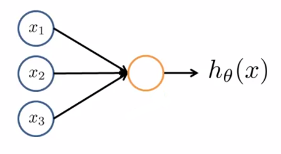
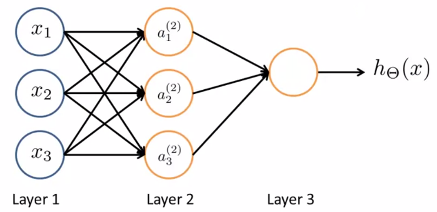

# Neural Networks

Here,
$$
h_\theta (x) = \frac{1}{1 + e^{-\theta^T x}} \\[5ex]
x =
\begin{bmatrix}
x_0 \\
x_1 \\
x_2 \\
x_3
\end{bmatrix}
\quad \quad \quad \quad
\text{(Weights)}\space \theta =
\begin{bmatrix}
\theta_0 \\
\theta_1 \\
\theta_2 \\
\theta_3
\end{bmatrix}
$$
For Bias, we can have an extra node $x_0$ as input. The above represents an artificial neuron with a **Sigmoid (Logistic) Activation Function**.
$$
g(z) = \frac{1}{1 + e^{-Z}}
$$

#### Hidden Layer

A neural network can have one or more hidden layers, and these layers can have bias such as $a_0^{(2)}$

Here,

- $a_i^{(j)} =$ “Activation” of unit $i$ in layer $j$
- $\theta^{(j)} =$ Matrix of weights controlling function mapping from layer $j$ to layer $(j+1)$

Computations on the above represented neural network:
$$
a_1^{(2)} = g(\theta_{10}^{(1)} x_0 + \theta_{11}^{(1)} x_1 + \theta_{12}^{(1)} x_2 + \theta_{13}^{(1)} x_3) \\[2ex]
a_2^{(2)} = g(\theta_{20}^{(1)} x_0 + \theta_{21}^{(1)} x_1 + \theta_{22}^{(1)} x_2 + \theta_{23}^{(1)} x_3) \\[2ex]
a_3^{(2)} = g(\theta_{30}^{(1)} x_0 + \theta_{31}^{(1)} x_1 + \theta_{32}^{(1)} x_2 + \theta_{33}^{(1)} x_3) \\[2ex]
h_\theta(x) = a_1^{(3)} = g(\theta_{10}^{(2)} a_0^{(2)} + \theta_{11}^{(2)} a_0^{(2)} + \theta_{12}^{(2)} a_0^{(2)} + \theta_{13}^{(2)} a_0^{(2)})
$$
If the network has $s_j$ units in layer $j$, $s_{j+1}$ units in layer $(j+1)$, then $\theta^{(j)}$ will be of dimension $s_{j+1} * (s_j + 1)$

### Vectorized Implementation (Forward Propagation)

Let’s assign:
$$
a_1^{(2)} = g(\theta_{10}^{(1)} x_0 + \theta_{11}^{(1)} x_1 + \theta_{12}^{(1)} x_2 + \theta_{13}^{(1)} x_3) = g(z_1^{(2)})\\[2ex]
a_2^{(2)} = g(\theta_{20}^{(1)} x_0 + \theta_{21}^{(1)} x_1 + \theta_{22}^{(1)} x_2 + \theta_{23}^{(1)} x_3) = g(z_2^{(2)}) \\[2ex]
a_3^{(2)} = g(\theta_{30}^{(1)} x_0 + \theta_{31}^{(1)} x_1 + \theta_{32}^{(1)} x_2 + \theta_{33}^{(1)} x_3) = g(z_3^{(2)}) \\[2ex]
h_\theta(x) = a_1^{(3)} = g(\theta_{10}^{(2)} a_0^{(2)} + \theta_{11}^{(2)} a_0^{(2)} + \theta_{12}^{(2)} a_0^{(2)} + \theta_{13}^{(2)} a_0^{(2)}) = g(z^{(3)})
$$
Therefore, we now have:
$$
x =
\begin{bmatrix}
x_0 \\
x_1 \\
x_2 \\
x_3
\end{bmatrix}
\quad \quad \quad \quad
z^{(2)} =
\begin{bmatrix}
z_1^{(2)} \\
z_2^{(2)} \\
z_3^{(2)}
\end{bmatrix}
$$
Now we can vectorize the computation as:
$$
z^{(2)} = \theta^{(1)}x = \theta^{(1)} \sdot a^{(1)} \\[2ex]
a^{(2)} = g(z^{(2)})
$$

For adding the bias in the hidden layer,
$$
a_0^{(2)} = 1 \\[2ex]
z^{(3)} = \theta^{(2)} \sdot a^{(2)} \\[2ex]
h_\theta(x) = a^{(3)} = g(z^{(3)})
$$
