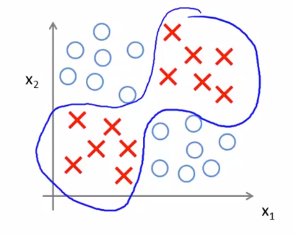
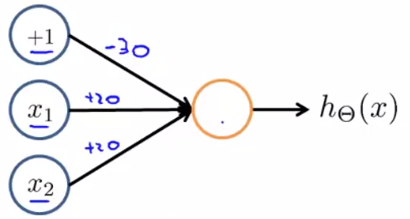
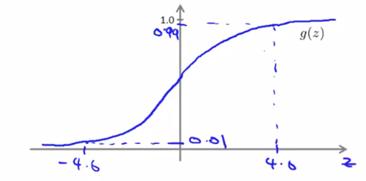
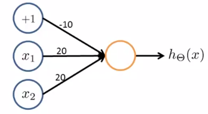
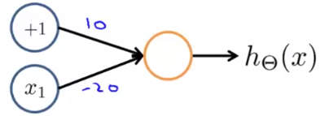
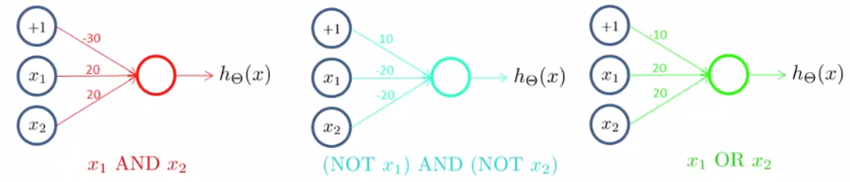
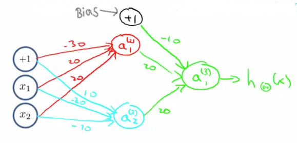
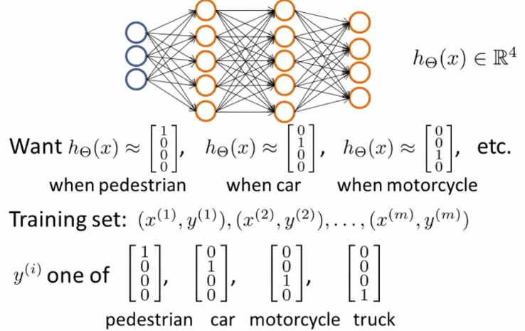

# Applications and Intuition

Consider the example, where $x_1$ and $x_2$ are binary (0 or 1). We’ll try to come up with a neural network that can fit this set. Let’s consider a one unit neural network as follows:

$x_1, x_2 \in \{0,1\}$

$y = x_1 \space \text{AND} \space x_2$

## Intuition 1

Selected Parameters are:
$$
\theta_{10}^{(1)} = -30 \quad \theta_{11}^{(1)} = 20 \quad \theta_{12}^{(1)} = 20 \\[2ex]
\text{Therefore,} \quad
h_\theta(x) = g(-30 + 20x_1 + 20x_2)
$$
Our sigmoid function will be:

| $x_1$ | $x_2$ | $h_\theta(x)$ [Logical AND] |
| ----- | ----- | --------------------------- |
| 0     | 0     | $g(-30) \approx 0$          |
| 0     | 1     | $g(-10) \approx 0$          |
| 1     | 0     | $g(-10) \approx 0$          |
| 1     | 1     | $g(10) \approx 1$           |

Our $h_\theta(x)$ above is computing logical AND function.

Let’s create another single unit neural network for computing the OR function. We’ll assign the parameters as:
$$
\theta_{10}^{(1)} = -10 \quad \theta_{11}^{(1)} = 20 \quad \theta_{12}^{(1)} = 20 \\[2ex]
\text{Therefore,} \quad
h_\theta(x) = g(-10 + 20x_1 + 20x_2)
$$

| $x_1$ | $x_2$ | $h_\theta(x) $ [Logical OR] |
| ----- | ----- | --------------------------- |
| 0     | 0     | $g(-10) \approx 0 $         |
| 0     | 1     | $g(10) \approx 1$           |
| 1     | 0     | $g(10) \approx 1$           |
| 1     | 1     | $g(30) \approx 1$           |

## Intuition 2

We can come up with a small network for performing negation. We’ll assign the parameters:
$$
\theta_{10}^{(1)} = 10 \quad \theta_{11}^{(1)} = -20 \\[2ex]
\text{Therefore,} \quad
h_\theta(x) = g(10 - 20x_1)
$$

| $x_1$ | $h_\theta(x)$      |
| ----- | ------------------ |
| 0     | $g(10 ) \approx 1$ |
| 1     | $g(-10) \approx 0$ |

#### Merging the Neural Networks

Putting the above three together to compute $x_1 \space \text{XNOR} \space x_2$,

| $x_1$ | $x_2$ | $a_1^{(2)}$ | $a_2^{(2)}$ | $h_\theta(x)$ |
| ----- | ----- | ----------- | ----------- | ------------- |
| 0     | 0     | 0           | 1           | 1             |
| 0     | 1     | 0           | 0           | 0             |
| 1     | 0     | 0           | 0           | 0             |
| 0     | 1     | 1           | 0           | 1             |

### Multiclass Classification

