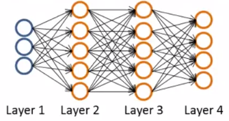
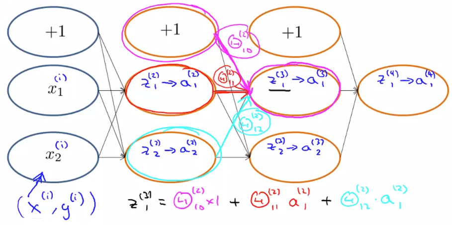
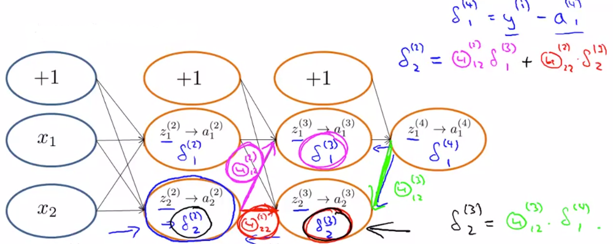

## Cost Function

Suppose we have a training set $\{(x^{(1)}, y^{(1)}), (x^{(2)}, y^{(2)}), \cdots, (x^{(m)}, y^{(m)}) \}$ and the below network:

Consider,

- $L =$ Total number of layers
- $s_l =$ Number of Units/Neurons (not counting bias unit) in layer $l$

We’ll consider the following:

- **Binary Classification**

    $h_\theta(x) \in R$

    $s_l = 1$ [$l=$ Index of the output layer]

    $K=1$ [$K =$ Number of units in the output layer]

- **Multi-class Classification**

    $h_\theta(x) \in R^K$

    $s_l = K$ [$l=$ Index of the output layer]

    $K \geq 3$ [$K =$ Number of units in the output layer]

### Cost Function

For Logistic Regression, we had
$$
J(\theta) = -\frac{1}{m} \Bigg[\sum_{i=1}^m y^{(i)} \log h_\theta(x^{(i)}) + (1-y^{(i)}) \log(1-h_\theta(x^{(i)})) \Bigg] + \frac{\lambda}{2m} \sum_{j=1}^n \theta_j^2
$$
In Neural Networks, our cost function will be a generalization of the above,
$$
h_\theta(x) \in R^K
\quad \quad \quad \quad
(h_\theta(x))_i = i^{th} \space \text{output} \\[2ex]
J(\theta) = -\frac{1}{m} \Bigg[\sum_{i=1}^{m} \sum_{k=1}^{K} y_k^{(i)} \log(h_\theta(x^{(i)}))_k + (1-y_k^{(i)}) \log(1-(h_\theta(x^{(i)}))_k) \Bigg] + \frac{\lambda}{2m} \sum_{l=1}^{L-1} \sum_{i=1}^{s_l} \sum_{j=1}^{s_l+1} (\theta_{ji}^{(l)})^2
$$
In the regularization part, after the square brackets, we must account for multiple theta matrices. The number of columns in our current theta matrix is equal to the number of nodes in our current layer (including the bias unit). The number of rows in our current theta matrix is equal to the number of nodes in the next layer (excluding the bias unit). As before with logistic regression, we square every term.

> Suppose we want to try to minimize $J(\theta)$ as a function of $\theta$, using one of the advanced optimization methods (fminunc, conjugate gradient, BFGS, L-BFGS, etc.). What do we need to supply code to compute (as a function of $\theta$)?
>
> - [ ] $\theta$
> - [ ] $J(\theta)$
> - [ ] The partial derivative terms $\frac{\partial}{\partial \theta_{ij}^{(l)}}$ for every $i, j, l$
> - [x] $J(\theta)$ and the partial derivative terms $\frac{\partial}{\partial \theta_{ij}^{(l)}}$ for every $i, j, l$

**Note:**

- The double sum simply adds up the logistic regression costs calculated for each cell in the output layer
- The triple sum simply adds up the squares of all the individual $\theta\text{'s}$ in the entire network
- The $i$ in the triple sum does **not** refer to training example $i$

### Backpropagation

For Gradient computation, our goal is to compute the following:

- $J(\theta)$
- $\frac{\partial}{\partial \theta_{ij}^{(l)}} J(\theta)$

##### Given one training example $(x, y)$. We’ll first apply forward propagation as follows:

$a^{(1)} = x$

$z^{(2)} = \theta^{(1)} a^{(1)}$

$a^{(2)} = g(z^{(2)}) \quad \quad (\text{add} \space a_0^{(2)})$

 $z^{(3)} = \theta^{(2)} a^{(2)}$

$a^{(3)} = g(z^{(3)}) \quad \quad (\text{add} \space a_0^{(3)})$

$z^{(4)} = \theta^{(3)} a^{(3)}$

$a^{(4)} = h_\theta(x) = g(z^{(4)})$

##### Now, for Gradient computation or Backpropagation, we’ll do the following:

Intuition: $\delta_j^{(l)} =$ “error” of node $j$ in layer $l$

For each output unit (Layer $L=4$), $\delta_j^{(4)} = (h_\theta(x))_j - y_j = a_j^{(4)} - y_j$

Now, we compute for earlier layers,

$\delta^{(3)} = (\theta^{(3)})^T \delta^{(4)} \sdot * g'(z^{(3)}) \quad \quad \quad \Big[g'(z^{(3)}) = a^{(3)} \sdot * (1-a^{(3)}) \Big]$

$\delta^{(2)} = (\theta^{(2)})^T \delta^{(3)} \sdot * g'(z^{(2)}) \quad \quad \quad \Big[g'(z^{(2)}) = a^{(2)} \sdot * (1-a^{(2)}) \Big]$

There is no $\delta^{(1)}$ as layer 1 is the input layer

##### Now suppose we have a large training set $\{(x^{(1)}, y^{(1)}), (x^{(2)}, y^{(2)}), \cdots, (x^{(m)}, y^{(m)}) \}$

Set $\triangle_{ij}^{(l)} = 0 \quad \quad \quad \text{for all $l, i, j$}$

$\text{for} \space i=1 \space \text{to} \space m$:

- Set $a^{(i)} = x^{(i)}$
- Perform Forward Propagation to compute $a^{(l)}$ for $l=2, 3, \cdots, L$
- Using $y*{(i)}$, compute $\delta^{(L)} = a^{(L)} - y^{(i)}$
- Compute $\delta^{(L-1)}, \delta^{(L-2)}, \cdots, \delta^{(2)}$
- $\triangle_{ij}^{(l)} := \triangle_{ij}^{(l)} + a_j^{(l)} \delta_i^{(l+1)}$

$D_{ij}^{(l)} := \frac{1}{m} \triangle_{ij}^{(l)} + \lambda \theta_{ij}^{(l)} \quad \quad \quad \text{if} \space j \neq 0$

$D_{ij}^{(l)} := \frac{1}{m} \triangle_{ij}^{(l)} \quad \quad \quad \text{if} \space j = 0 \space \text{(Bias Term)}$

The above is equal to:
$$
\frac{\partial}{\partial \theta_{ij}^{(l)}} J(\theta) = D_{ij}^{(l)}
$$

## Intuition

Let’s consider the following Forward Propagation,

#### What is Backpropagation doing?

$$
J(\theta) = -\frac{1}{m} \Bigg[\sum_{i=1}^{m} \log(h_\theta(x^{(i)})) + (1-y^{(i)}) \log(1-(h_\theta(x^{(i)}))) \Bigg]
$$

Focussing on a single example $x^{(i)}, y^{(i)}$, the case of 1 output unit, and ignoring regularization ($\lambda=0$),
$$
\text{cost}(i) = y^{(i)} \log h_\theta(x^{(i)}) + (1-y^{(i)}) \log h_\theta(x^{(i)})
$$
Assume, $\text{cost}(i) \approx (h_\theta(x^{(i)})-y^{(i)})^2$

It basically finds how well is the network doing on example $i$

$\delta_j^{(l)} =$ “error” of cost for $a_j^{(l)}$ (unit $j$ in layer $l$)
$$
\delta_j^{(l)} = \frac{\partial}{\partial z_j^{(l)}} \text{cost}(i)
\quad \quad \quad (\text{for} \space j\geq0), \\[2ex]
\text{Where,} \quad \text{cost}(i) = y^{(i)} \log h_\theta(x^{(i)}) + (1-y^{(i)}) \log h_\theta(x^{(i)})
$$

