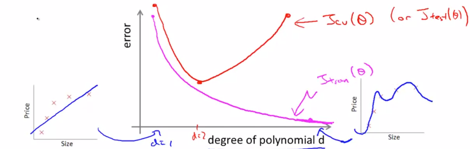
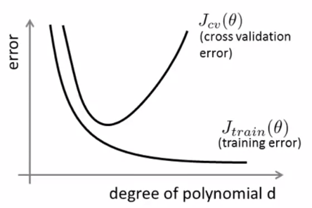
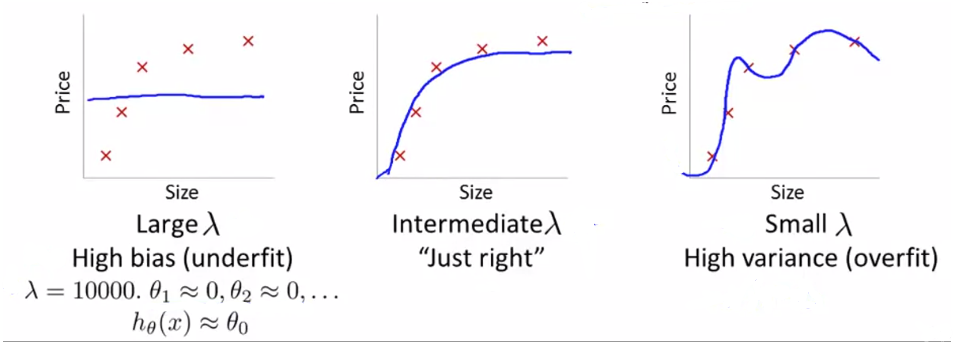
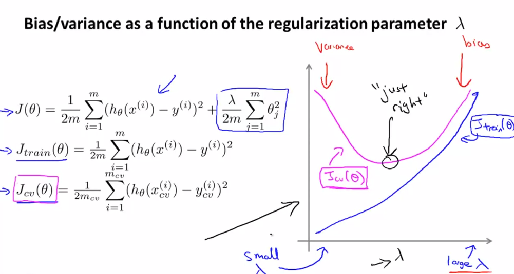
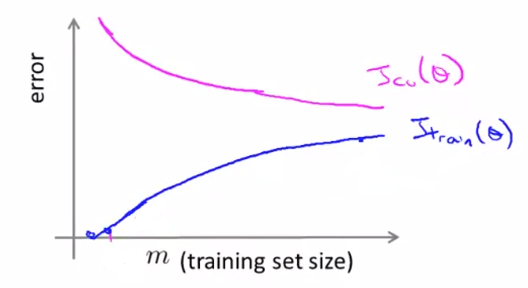
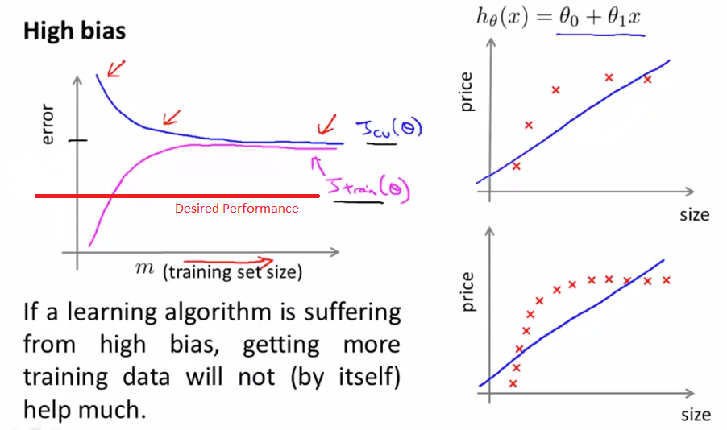
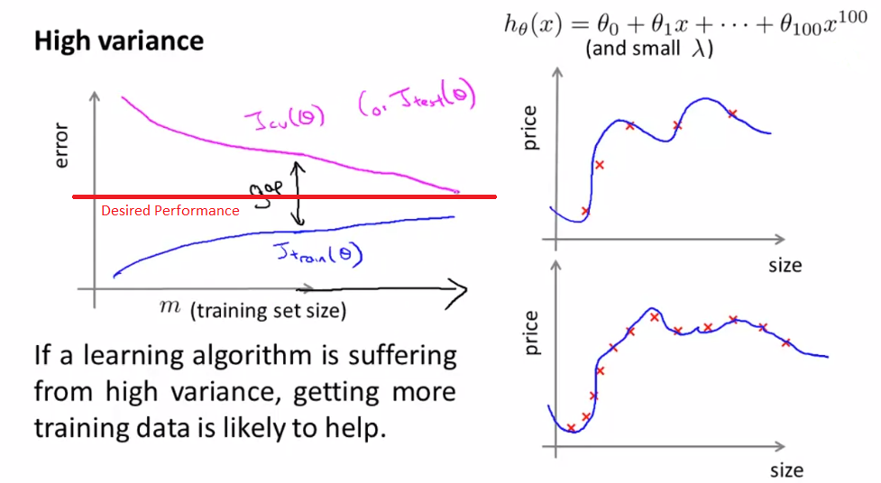
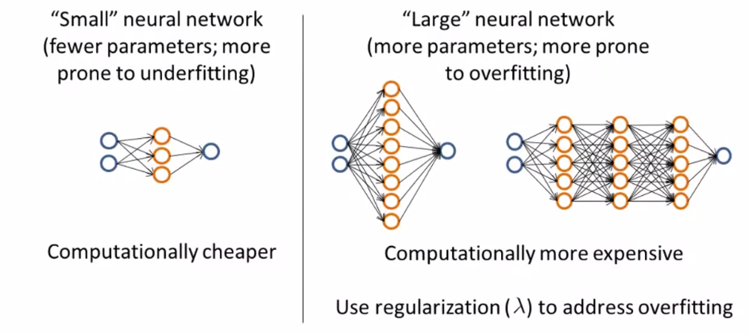

# Bias vs Variance

We have,

- Training Error
    $$
    J_{train}(\theta) = \frac{1}{2m} \sum_{i=1}^{m} (h_\theta(x^{(i)})-y^{(i)})^2
    $$

- Cross Validation Error
    $$
    J_{cv}(\theta) = \frac{1}{2m_{cv}} \sum_{i=1}^{m_{cv}} (h_\theta(x_{cv}^{(i)})-y_{cv}^{(i)})^2
    $$

As we increase the degree of our polynomial, we see that the error decreases. The cross validation error will start with very high error, reach its lowest point somewhere where the degree of polynomial is not too high or too low, and again increase as the degree of polynomial increases, which is basically reaching overfitting. Plotting these like the one above, can help resolve errors much quickly.

So, if the algorithm is suffering from a bias problem (underfit),

- $J_{train}(\theta)$ will be high
- $J_{cv}(\theta) \approx J_{train}(\theta)$

If the algorithm is suffering from a high variance (overfit),

- $J_{train}(\theta)$ will be low
- $J_{cv}(\theta) >> J_{train}(\theta)$

## Regularization with Bias/Variance

##### Linear Regression with Regularization

$$
h_\theta(x) = \theta_0 + \theta_1x + \theta_2x^2 + \theta_3x^3 + \theta_4x^4
\\[3ex]
J(\theta) = \frac{1}{2m} \sum_{i=1}^m (h_\theta(x^{(i)})-y^{(i)}) + \frac{\lambda}{2m} \sum_{j=1}^m \theta_j^2
$$

##### Choosing the Regularization Parameter $\lambda$

$$
J_{train}(\theta) = \frac{1}{2m} \sum_{i=1}^m (h_\theta(x^{(i)})-y^{(i)})^2
\\[2ex]
J_{cv}(\theta) = \frac{1}{2m_{cv}} \sum_{i=1}^{m_{cv}} (h_\theta(x_{cv}^{(i)})-y_{cv}^{(i)})^2
\\[2ex]
J_{test}(\theta) = \frac{1}{2m_{test}} \sum_{i=1}^{m_{test}} (h_\theta(x_{test}^{(i)})-y_{test}^{(i)})^2
$$

Steps to try (Step the values up by doubling them):

1. Try $\lambda=0 \rarr min_{\theta} \rarr \theta^1 \rarr J_{cv}(\theta^{(1)})$

2. Try $\lambda=0.01 \rarr min_{\theta} \rarr \theta^2 \rarr J_{cv}(\theta^{(2)})$

3. Try $\lambda=0.02 \rarr min_{\theta} \rarr \theta^3 \rarr J_{cv}(\theta^{(3)})$

4. Try $\lambda=0.04 \rarr min_{\theta} \rarr \theta^4 \rarr J_{cv}(\theta^{(4)})$

5. Try $\lambda=0.08 \rarr min_{\theta} \rarr \theta^5 \rarr J_{cv}(\theta^{(5)})$

    $\vdots$

12. Try $\lambda=10.24 \rarr min_{\theta} \rarr \theta^{12} \rarr J_{cv}(\theta^{(12)})$

Pick whichever one of these 12 models gives the lowest error on the cross-validation set. Suppose $\theta^{(5)}$ gives the lowest error and we pick it. Then compute the test set error $J_{test}(\theta^{(5)})$.

## Learning Curves

This is very useful when we want to:

- Sanity check that the algorithm is working correctly
- Prove the performance of the algorithm
- Diagnose a learning algorithm suffering from a high bias or variance problem

$$
J_{train}(\theta) = \frac{1}{2m} \sum_{i=1}^m (h_\theta(x^{(i)})-y^{(i)})^2
\\[2ex]
J_{cv}(\theta) = \frac{1}{2m_{cv}} \sum_{i=1}^{m_{cv}} (h_\theta(x_{cv}^{(i)})-y_{cv}^{(i)})^2
$$

When m=1, 2 or 3, the Training Error on the Training Set is going to be 0, assuming we’re not using regularization. In our case, we will artificially reduce the number of training examples and deliberately omit some of the training sets. As training set gets larger and larger the quadratic function can no longer fit the examples perfectly and the average training set error increases.

## Relation with Neural Networks

