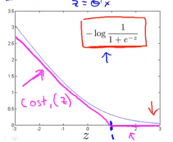
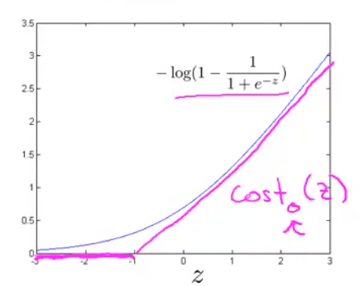
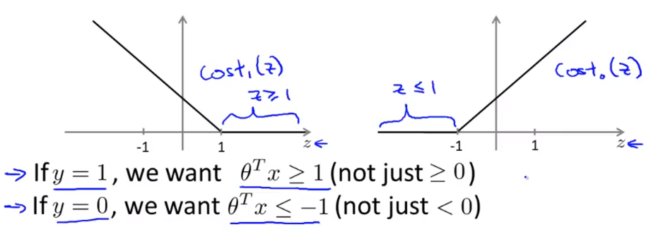
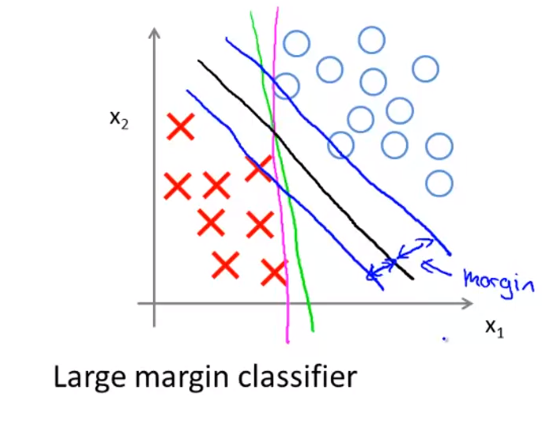

# Support Vector Machine

#### Alternate view of Logistic Regression

$$
h_\theta(x) = \frac{1}{1+e^{-\theta^Tx}}
$$

If $y=1$, we want $h_\theta(x) \approx 1$, which is $\theta^T x >> 0$

If $y=0$, we want $h_\theta(x) \approx 0$, which is $\theta^T x << 1$

The term which a single training example contributes to the overall logistic regression:
$$
\begin{align*}
\text{Cost of Example} &= -(y \log h_\theta(x) + (1-y) \log(1-h_\theta(x))) \\
&= -y \log \frac{1}{1+e^{-\theta^T x}} - (1-y) \log(1- \frac{1}{1+e^{-\theta^T x}})
\end{align*}
$$

If $y=1$ (want $\theta^Tx >> 0$):

If $y=0$ (want $\theta^Tx << 1$):

We had the cost function for Logistic Regression as:
$$
\min_\theta \frac{1}{m} \biggl[ \sum_{i=1}^m y^{(i)} \big(- \log_\theta(x^{(i)}) \big) + (1-y^{(i)}) \big(-log(1-h_\theta(x^{(i)})) \big) \biggr] + \frac{\lambda}{2m} \sum_{j=1}^n \theta_j^2
$$

### Support Vector Machine

Cost Function:
$$
\min_\theta \frac{1}{m} \biggl[ \sum_{i=1}^m y^{(i)} \text{cost}_1(\theta^Tx^{(i)}) + (1-y^{(i)}) \text{cost}_0(\theta^Tx^{(i)}) \biggr] + \frac{\lambda}{2m} \sum_{j=1}^n \theta_j^2
\\[4ex] \text{Getting rid of }\frac{1}{m} \text{ terms} \\[2ex]
\min_\theta \biggl[ \sum_{i=1}^m y^{(i)} \text{cost}_1(\theta^Tx^{(i)}) + (1-y^{(i)}) \text{cost}_0(\theta^Tx^{(i)}) \biggr] + \frac{\lambda}{2} \sum_{j=1}^n \theta_j^2
\\[4ex] \text{Getting rid of }\lambda \text{ and adding new constant } C \\[2ex]
\min_\theta C \biggl[ \sum_{i=1}^m y^{(i)} \text{cost}_1(\theta^Tx^{(i)}) + (1-y^{(i)}) \text{cost}_0(\theta^Tx^{(i)}) \biggr] + \frac{\lambda}{2} \sum_{j=1}^n \theta_j^2
$$
Where $C \approx \frac{1}{\lambda}$

Hypothesis:
$$
h_\theta(x) =
\begin{cases}
1 & \text{if } \theta^x >> 0 \\[2ex]
0 & \text{otherwise}
\end{cases}
$$

### SVM Decision Boundary

- Whenever $y^{(i)} = 1$

    $\theta^Tx^{(i)} \geq 1$

- Whenever $y^{(i)} = 0$

    $\theta^Tx^{(i)} \leq -1$

