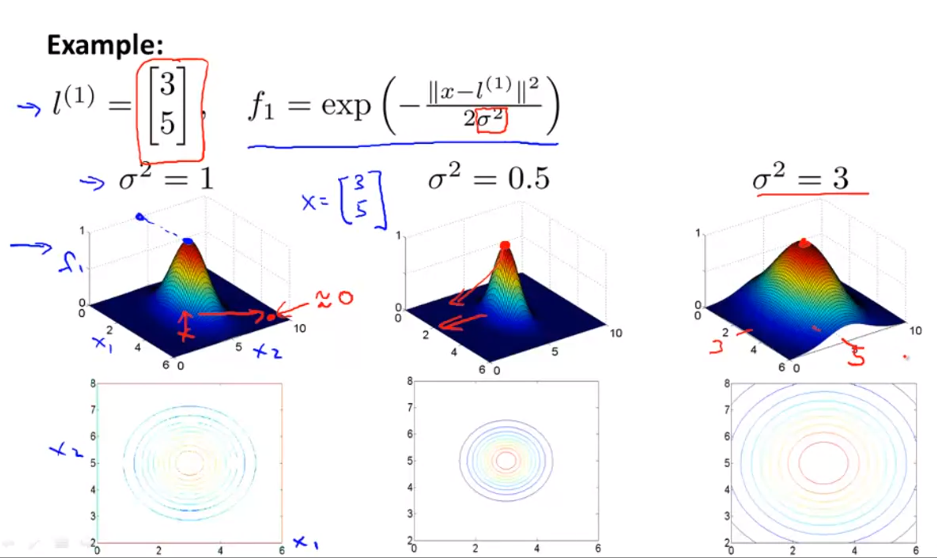
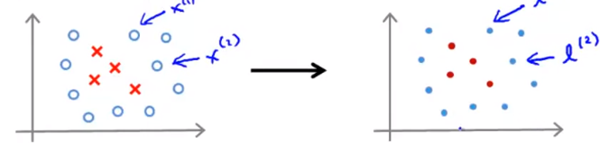

# Kernels

### Non-Linear Decision Boundary

One way to find the decision boundary in this case is to come up with polynomial features like, predict $y=1$ if:
$$
h_\theta(x) =
\begin{cases}
1 & \text{if } \theta_0 + \theta_1 x_1 + \theta_2 x_2 + \theta_3 x_1 x_2 + \theta_4 x_1^2 + \theta_5 x_2^2 + \dots \geq 0 \\[2ex]
0 & \text{otherwise}
\end{cases}
$$
We can simplify the notation here for $h_\theta(x) = 1$ as:
$$
\theta_0 + \theta_1 f_1 + \theta_2 f_2 + \theta_3 f_3 + \dots
$$
Where, $f_1 = x_1$, $f_2 = x_2$ and so on

The objective is to find a better choice of features than these higher order polynomials

### Kernel

Let’s pick three random points in the graph and call them **landmarks**.

Now the objective is:

> Given *x*, compute new features depending on proximity to the landmarks

#### Kernels (Gaussian Kernels)

$$
f_1 = \text{similarity}(x, l^{(1)}) = \text{exp} \bigg(- \frac{||x-l^{(1)}||^2}{2 \sigma^2} \bigg) \\[2ex]
f_2 = \text{similarity}(x, l^{(2)}) = \text{exp} \bigg(- \frac{||x-l^{(2)}||^2}{2 \sigma^2} \bigg) \\[2ex]
\vdots \\[2ex]
\text{Other Features}
$$

Where, $||x-l^{(1)}||$ is the Euclidean distance

### Kernels and Similarity

$$
\begin{align*}
f_1 &= \text{similarity}(x, l^{(1)}) \\[2ex]
&= \text{exp} \bigg(- \frac{||x-l^{(1)}||^2}{2 \sigma^2} \bigg) \\[2ex]
&= \text{exp} \bigg(- \frac{\sum_{j=1}{n}(x_j - l_j^{(1)})}{2 \sigma^2} \bigg)
\end{align*}
$$

If $x \approx l^{(1)}$:
$$
f_1 \approx \text{exp} \bigg(- \frac{0^2}{2 \sigma^2} \bigg) \approx 1
$$
If *x* is far from, $l^{(1)}$:
$$
f_1 = \text{exp} \bigg(- \frac{(\text{Large Number})^2}{2 \sigma^2} \bigg) \approx 0
$$

#### Choosing the Landmarks

Given $(x^{(1)}, y^{(1)}), (x^{(2)}, y^{(2)}), \dots, (x^{(m)}, y^{(m)})$

Choose $l^{(1)}=x^{(1)}, l^{(2)}=x^{(2)}, \dots, l^{(m)}=x^{(m)}$

Given example $x$:

- $f_1 =$ Similarity $(x, l^{(1)})$
- $f_2 =$ Similarity $(x, l^{(2)})$
- $\dots$

Then we will get a feature and the feature vector as,
$$
f=
\begin{bmatrix}
f_0 \\
f_1 \\
f_2 \\
\vdots \\
f_m
\end{bmatrix}
\quad \quad \quad \quad \quad \quad 
f^{(i)}=
\begin{bmatrix}
f_0^{(i)} \\
f_1^{(i)} \\
f_2^{(i)} \\
\vdots \\
f_m^{(i)}
\end{bmatrix}
$$
Where, $f_0 = 1$ (Similar to an intercept term)

Now for training example $(x^{(i)}, y^{(i)})$:
$$
X^{(i)} \rarr
\begin{cases}
f_1^{(i)} = \text{sim} (x^{(i)}, l^{(1)}) \\[2ex]
f_2^{(i)} = \text{sim} (x^{(i)}, l^{(2)}) \\[2ex]
\vdots \\[2ex]
f_i^{(i)} = \text{sim} (x^{(i)}, l^{(i)}) = \text{exp} (-\frac{0}{2\sigma^2}) = 1 \\[2ex]
\vdots \\[2ex]
f_m^{(i)} = \text{sim} (x^{(i)}, l^{(m)}) \\[2ex]
\end{cases}
$$

### SMV with Kernels

**Hypothesis**: Given $x$, compute features $f \in R^{m+1}$

Predict $y=1$ if $\theta^T f \geq 0$

Training:
$$
\min_\theta C \biggl[ \sum_{i=1}^m y^{(i)} \text{cost}_1(\theta^T f^{(i)}) + (1-y^{(i)}) \text{cost}_0(\theta^T f^{(i)}) \biggr] + \frac{\lambda}{2} \sum_{j=1}^n \theta_j^2
$$

SVM Parameters:

- Large $C$: Lower bias, high variance
- Small $C$: Higher bias, low variance
- Large $\sigma^2$: Features $f_i$ vary more smoothly (Higher bias, lower variance)
- Small $\sigma^2$: Features $f_i$ vary less smoothly (Lower bias, higher variance)

