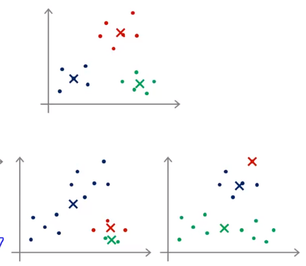
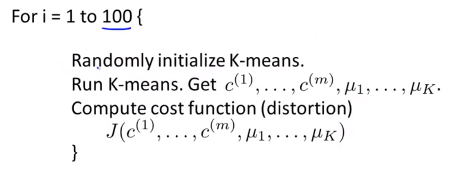
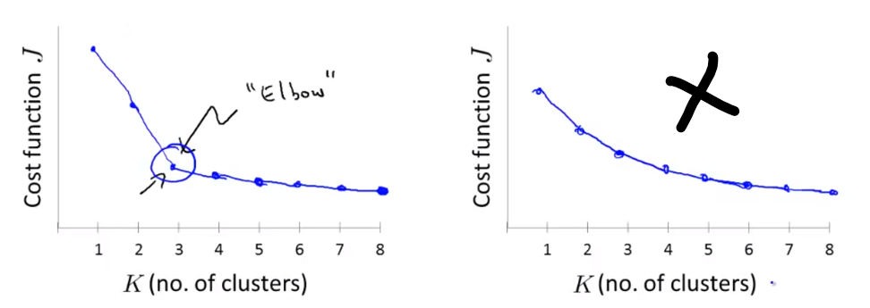
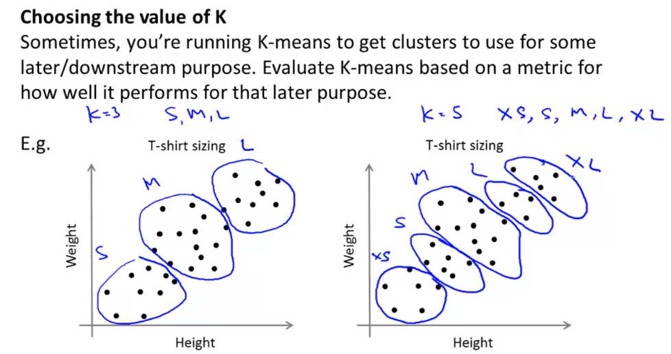

# Clustering

In Unsupervised Learning, we get only x’s in a training set and no y’s

Training Set: ${x^{(1)}, x^{(2)}, x^{(3)}, \dots, x^{(m)}}$

## K-Means

Inputs:

- $K$ (Number of Clusters)
- Training set ${x^{(1)}, x^{(2)}, x^{(3)}, \dots, x^{(m)}}$

$x^{(i)} \in R^n$ (drop $x_0=1$ convention)

Randomly initialize $K$ cluster centroids $\mu_1, \mu_2, \dots, \mu_K \in R^n$

repeat {

- for $i=1$ to $m$

    $c^{(i)} :=$ index (from 1 to K) of cluster centroid closest to $x^{(i)}$ $[\text{min}_k || x^{(i)} - \mu_k ||^2]$

    (while holding $\,u_1, \dots, \mu_K$ fixed)

- for $k=1$ to $K$

    $\mu_K :=$ average (mean) of points assigned to cluster $k$

}

Steps:

- Cluster Assignment
- Move Centroid
- Repeat the above two until convergence

### Optimization Objective

Notations:

- $c^{(i)} = $ index of cluster $(1, 2, \dots, K)$ to which example $x^{(i)}$ is currently assigned
- $\mu_k = $ cluster centroid $k$ where $(\mu_k \in R^n)$
- $\mu_{c^{(i)}} = $ cluster centroid of cluster to which example $x^{(i)}$ has been assigned

Objective:
$$
J(c^{(1)}, \dots, c^{(m)}, \mu_{1}, \dots, \mu_{K}) = \frac{1}{m} \sum_{i=1}^m ||x^{(i)}-\mu_{c^{(i)}}||^2 \\[4ex]
\text{min} J(c^{(1)}, \dots, c^{(m)}, \mu_{1}, \dots, \mu_{K})
$$

### Random Initialization

- Should have $K < m$
- Randomly pick $K$ training examples
- Set $\,u_1, \dots, \mu_K$ equal to these $K$ examples

Some examples of K-Means Local Optima:

Solution for getting a good set of clusters is to randomly initialize the centroids multiple times and run K-Means multiple times. For instance, run it 100 times to make sure we find the global optimum.

Now pick clustering that gave the lowest cost $J(c^{(1)}, \dots, c^{(m)}, \mu_{1}, \dots, \mu_{K})$

**Note**: This is useful only when the value of $K$ is less than 10, that is we’re looking for around 10 clusters. When we’re looking for a significant large number of clusters, running K-Means multilple times will not likely give solutions with huge difference in cost.

### Choosing the number of Clusters

Usually we pick the value of $K$ manually based on visualizations and plots but some methods are there too.

**Elbow Method**

Sometimes we can plot the cost function with respect to number of clusters chosen and find an “elbow” in the graph and pick the corresponding value of the number of clusters from it.

But if the graph doesn’t yeild out a clear cut elbow, it’s better off picking the number of clusters manually

**Other examples and methods:**

We can choose number of clusters based on t-shirt sizes here, for example some company would like to distinguish market based on 3 sizes of t-shirt, and some might want to distinguish based on 5 sizes

