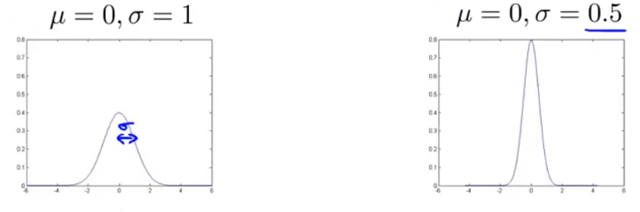
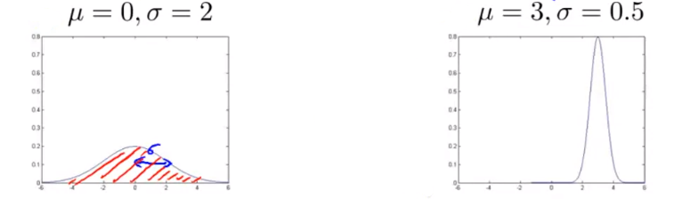

# Density Estimation

Dataset: ${x^{(1)}, x^{(2)}}, \dots, x^{(m)}$

Objective is to find if $x_{test}$ is anomalous

We can detect anomalies with some classification like:
$$
p(x_{test})
\begin{cases}
< \epsilon & \text{anomaly} \\[2ex]
\geq \epsilon & \text{OK}
\end{cases}
$$

### Use Cases

- Fraud Detection

    - $x^{(i)} =$ Features of user i’s activities
    - Model $p(x)$ from data
    - Identify unusual users by checking which have $p(x)<\epsilon$

- Manufacturing

- Monitoring Data Centre Computers

    $x{(i)} =$ Features of machine $i$

    $x_1=$ Memory Use

    $x_2=$ Number of disk accesses per second

    $x_3 =$ CPU Load

    $x_4=$ CPU Load / Network Traffic

    $\dots$ Other features

## Gaussian Distribution

Say $x \in \R$. If $x$ is a distributed Gaussian with mean $\mu$, variance $\sigma^2$. We can write this as:
$$
x \sim \aleph(\mu, \sigma^2)
$$

$$
\text{Gaussian Distribution}, p(x; \mu, \sigma^2) = \frac{1}{\sqrt{2\pi} \sigma} exp\bigg(-\frac{(x-\mu)^2}{2\sigma^2} \bigg)
$$

#### Examples

#### Parameter Estimation

$$
\mu = \frac{1}{m} \sum_{i=1}^{m}x^{i}
\\[3ex]
\sigma^2 = \frac{1}{m} \sum_{i=1}^m (x^{(i)}-\mu)^2
$$

## Algorithm

We can model $p(x)$ as:
$$
\begin{align}
p(x) &= p(x_1; \mu_1, \sigma_1^2) \sdot p(x_2; \mu_2, \sigma_2^2) \dots p(x_n; \mu_n, \sigma_n^2) \\[2ex]
&= \prod_{j=1}^n p(x_j; \mu_j, \sigma_j^2)
\end{align}
$$
Where,

- $x_1 \sim \aleph(\mu_1, \sigma_1^2)$

- $x_2 \sim \aleph(\mu_2, \sigma_2^2)$

    $\vdots$

- $x_n \sim \aleph(\mu_n, \sigma_n^2)$

So the algorithm would be:

1. Choose features $x_i$ that you think might be indicative of anomalous examples

2. Fit parameters $\mu_1, \dots, \mu_n, \sigma_1^2, \dots, \sigma_n^2$
    $$
    \mu_j = \frac{1}{m} \sum_{i=1}^m x_j^{(i)} \\[5ex]
    \sigma_j^2 = \frac{1}{m} \sum_{i=1}^m (x_j^{(i)}-\mu_j)^2
    $$

3. Given new example $x$, compute $p(x)$
    $$
    p(x) = \prod_{j=1}^n p(x_j, \mu_j, \sigma^2) = \prod_{j=1}^n \frac{1}{\sqrt{2\pi}\sigma_j} exp\bigg(- \frac{(x_j - \mu_j)^2}{2\sigma_j^2} \bigg)
    $$
    Anomaly if $p(x) < \epsilon$

