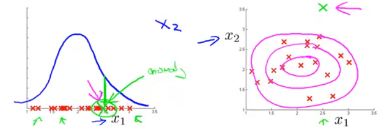

# Anomaly Detection

Considering the aircraft engines example, suppose we have 10,000 good engines and 20 flawed engines (anomalous). We should split them as follows:

- Training set: 6,000 good/normal engines (y=0)
- Cross Validation: 2,000 good/normal engines (y=0), 10 anomalous (y=1)
- Test: 2,000 good/normal engines (y=0), 10 anomalous (y=1)

### Algorithm Evaluation

Fit model $p(x)$ on training set $\{x^{(1)}, x^{(2)}, \dots, x^{(m)}\}$

On a cross-validation/test example $x$, predict:
$$
y =
\begin{cases}
1 &\text{if $p(x)<\epsilon$ (anomaly)} \\[2ex]
1 &\text{if $p(x)\geq\epsilon$ (normal)}
\end{cases}
$$
Possible evaluation metrics:

- True positive, false positive, false negative, true negative
- Precision/Recall
- $F_1$ score

We can also use cross-validation set to choose parameter $\epsilon$

| Anomaly Detection                                            | Supervised Learning                                          |
| ------------------------------------------------------------ | :----------------------------------------------------------- |
| Very small number of positive examples (y=1) and large number of negative examples. 0-20 is common. | Large number of positive and negative examples               |
| Many different types of anomalies. Hard for any algorithm to learn from positive examples what the anomalies look like; future anomalies may look nothing like any of the anomalous examples we’ve seen so far. | Enough positive examples for algorithm to get a sense of what positive examples are like, future positive examples likely to be similar to the ones in training set. |
| Examples: Fraud detection, manufacturing, monitoring machines in data centre | Examples: Email spam classification, weather prediction, cancer classification |

## Choosing Features

If the plot doesn’t produce a bow shape graph, maybe try to do some transformations which might result in a bow shaped Gaussian plot. For example,

- $x_1 \larr \log(x_1)$
- $x_2 \larr \log(x_2+1)$
- $x_3 \larr \sqrt{x_3}$
- $x_4 \larr x_4^{\frac{1}{3}}$

### Error Analysis

We want:

- $p(x)$ large for normal examples $x$
- $p(x)$ small for anomalous examples $x$

Most common problem: $p(x)$ is comparable (say, both large) for normal and anomalous examples

Look at the anomalies/mistakes that the algorithm is failing to flag and see if that can be used to create a new features, that might help distinguish anomalies

