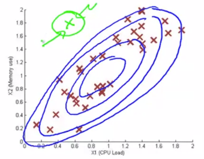

# Multivariate Gaussian Distribution

We have $x \in \R^n$. Now instead of modelling $p(x_1), p(x_2), \dots, \text{etc}$ separately, model $p(x)$ all in one go.

Parameters: $\mu \in \R^n, \sum \in \R^{n \times n}$ (covariance matrix)

##### Formula for Multivariate Gaussian Distribution:

$$
p(x; \mu, \Sigma) = \frac{1}{(2\pi)^{\frac{n}{2}} |\Sigma|^{\frac{1}{2}}} exp\bigg(-\frac{1}{2} (x-\mu)^T \Sigma^{-1} (x-\mu) \bigg)
$$

### Parameter Fitting

Given training set $\{ x^{(1)}, x^{(2)}, \dots, x^{(n)} \}$
$$
\mu = \frac{1}{m} \sum_{i=1}^m x^{(i)}
\quad \quad \quad
\Sigma = \frac{1}{m} \sum_{i=1}^m (x^{(i)} - \mu) (x^{(i)} - \mu)^T
$$

#### Anomaly Detection with Multivariate Gaussian

1. Fit model $p(x)$ by setting $\mu$ and $\Sigma$
    $$
    \mu = \frac{1}{m} \sum_{i=1}^m x^{(i)}
    \quad \quad \quad
    \Sigma = \frac{1}{m} \sum_{i=1}^m (x^{(i)} - \mu) (x^{(i)} - \mu)^T
    $$

2. Given a new example $x$, compute
    $$
    p(x) = \frac{1}{(2\pi)^{\frac{n}{2}} |\Sigma|^{\frac{1}{2}}} exp\bigg(-\frac{1}{2} (x-\mu)^T \Sigma^{-1} (x-\mu) \bigg)
    $$
    Flag an anomaly if $p(x) < \epsilon$

### Relation to Original Model

We have the original model as:
$$
p(x) = p(x_1;\mu_1,\sigma_1^2) \times p(x_2;\mu_2,\sigma_2^2) \times \dots \times p(x_n;\mu_n,\sigma_n^2)
$$

The original model corresponds to multivariate Gaussian, where the contours of the Gaussian are always axis alligned. Which means we will have our co-variance matrix like:
$$
\Sigma =
\begin{bmatrix}
\sigma_1^2 & 0 & 0 & \dots & 0 \\
0 & \sigma_2^2 & 0 & \dots & 0 \\
0 & 0 & \sigma_3^2 & \vdots & 0 \\
0 & 0 & 0 & \dots & \sigma_n^2
\end{bmatrix}
$$

| Original Model                                               | Multivariate Gaussian                                        |
| ------------------------------------------------------------ | ------------------------------------------------------------ |
| Manually create features to capture anomalies where $x_1, x_2$ take unusual combination of values | Automatically captures correlations between features         |
| Computationally cheaper (scales better to large values of $n$) | Computationally more expensive due to computation of $\Sigma^{-1}$ |
| Works okay even if $m$ (Training set size) is small          | Must have $m>n$, or else $\Sigma$ is non-invertible          |

